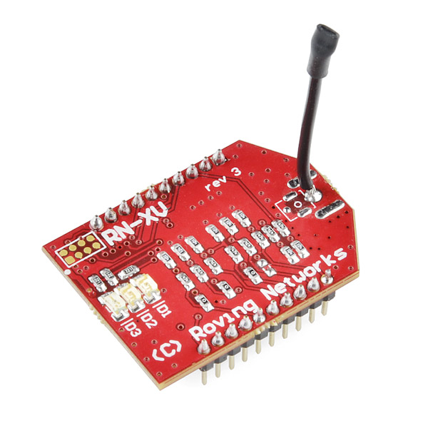

do buy:

 WiFly RN-XV — Completely
Baller WiFly
RN-XV: [http://www.sparkfun.com/products/10822](http://www.sparkfun.com/products/10822)

why? it’s cheap, and you can hook all sorts of widgets up to it with almost no
trouble at all!  It’s preloaded with a very feature rich f/w and you’ll be off
connecting your gidgets to all sorts of neat stuff.  I used it as a simple web
client, but also used it to run scan inquires.  Using this little unit was a
walk in the park!

don’t buy:

<table>
  <tbody>
    <tr>
      <td>
         MICROCHIP MRF2RWB0MB — At least he looks friendly
      </td>
      <td>
         but it’s actually a total jerk!
      </td>
    </tr>
  </tbody>
</table>

I don’t personally recommend the MIRCOCHIP MRF24WB0MB 11369ST (or similiar).  It
seems as though a handful of WiFi shields use it.  The SPI interface libraries
are seriously lame & lacking.  Doug H & I fought them for a few days.  We had
compile issues, as well as erratic behavior off the comm pins (o-scoped!).  Most
of the shields aren’t immediately ard.MEGA compatible.  Not a big deal, we can
remap pins!  But nothing would execute correctly, even after many deep digs into
the code, debug, and googling.  Not to mention, the RN-XV is way more capable,
and often the same price or cheaper!  If you’re thinking about this chip, abort!
