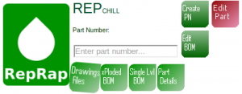

Repchill is a project to bring PDM & BOM management to the masses.  It is still in development and does not have a fixed, target release date.  Repchill is inspired by and informally associated with RepRap.org.

 Repchill Header Block Design goals are to:

- Be fully web-deployed
- Provide simple & fast tools to do BOM manipulation and structuring
- Provide simple & fast tools to do part analysis
- Enable easy part & file management

Repchill is is inspired by the core functionality offered in PTC’s Windchill product.  The primary intent is to simplify the PDM experience and not implement blanket solutions or features that bloat the intent of the application.

[http://www.static.cdaringe.com/archive/repchill/index.php](http://www.static.cdaringe.com/archive/repchill/index.php "Repchill")
