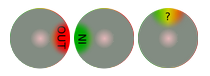

  
 I had a need for my soccer team’s roll call site to take inventory on who was coming to each game or not. no such control existed off the shelf, such that i would know if a player was ‘in’, ‘out’, or had not yet responded. i originally hacked up an [itoggle](http://labs.engageinteractive.co.uk/itoggle/ "itoggle"), but it lacked the ability to tell me if someone had responded yet or not. A two pole switch left me merging the ‘out’ and ‘not-yet-responded’ logic. I will eventually make this control configurable to infinite selectables (vs currently just 3) and give the user some more easy tweak-age options.

You can [fork it over github](https://github.com/cdaringe/RotarySwitch "fork it over at github") and attack my newbie coding skills. would love some input if people have ideas for improvement!

working [demo over here!](http://static.cdaringe.com/archive/rotaryswitch/ "RotarySwitch Demo")

