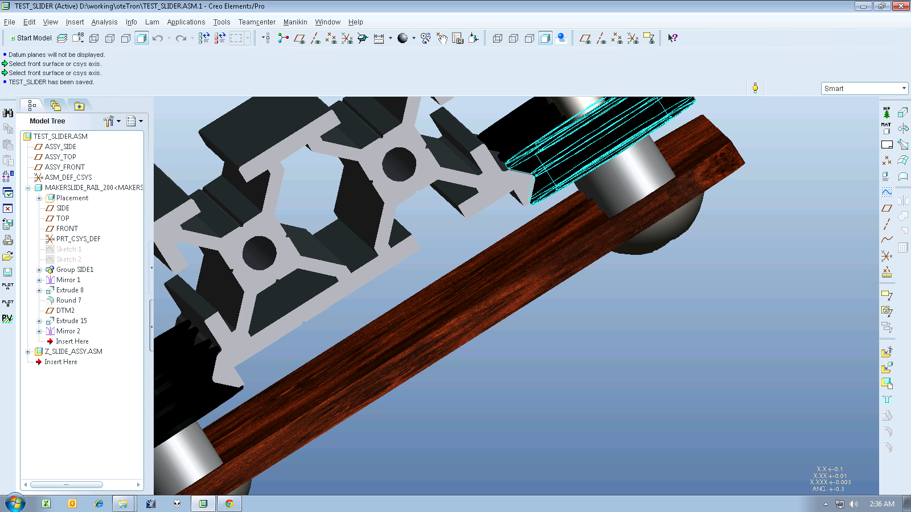

I’m starting to model out my 3rd reprap, except this one will be my own design.
It will combine elements of mendel 90, replicator 2, and
[corexy](http://www.corexy.com/ "corexy") (hopefully!). I modeled up the
makerslide adapter plate available for sale, but i noticed some interference. It
may be intentional by design because of the eccentric nuts!

MakerSlide looking to be a snug fit!
