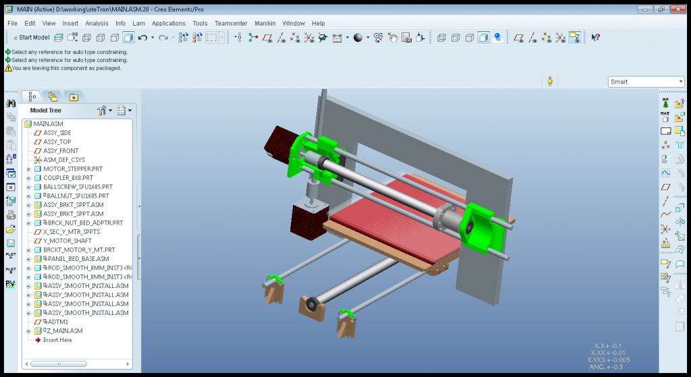

Since my last post, I gave up on using openrail or makerslide for any of my new printer’s axis.  At this point in time, although cheap, extruded-aluminum pulley-plates are still not the cheapest or most reliable slide mechanism available.  Thus, for linear bearings, I’m sticking with smooth rod and lm8uu’s, even if they aren’t the smoothest or the most rigid.  However, I’m not concerned with rigidity due to the fact that I’m loading a 3/4″ thick ball screw onto my x&y axis!  Next up is to port a bowden extruder and plug it into the model!

 O’ters Progress 

