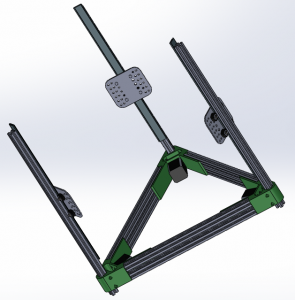

Look out people.  cOssel is inworks!  COssel’s goal is to be a simple iteration of Kossel, but with:

- Superior documentation
- Using OpenRail for linear motion
- Equip a dual head end effector by default, both bowden style

[http://reprap.org/wiki/COssel](http://reprap.org/wiki/COssel)

