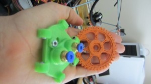

After using slic3r regularly for 1.5 years, I just now see that Alessandro actually gives his donors shout out on his donations page! [http://slic3r.org/donations](http://slic3r.org/donations).  I didn’t give much back then, but I may be the 5th donor.  Pretty cool.  It’s a wonderfully innovative product contrasted against our prior G-CODE generators.  I am very grateful to him for developing this and supporting open source.  Here’s a lovely pic showing a simple, poor quality gear I printed our old tool chains back in 2010, contrasted against a high quality, feature rich end effector for cOssel, with almost no hardware changes!

[Slic3r ](http://slic3r.org/ "Slic3r")played a critical role in making it thus far!

 Same hardware, new toolchains. Old, simple, poor quality gear. New, feature rich, high quality end effector
