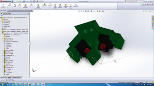
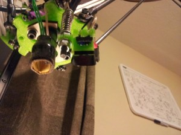
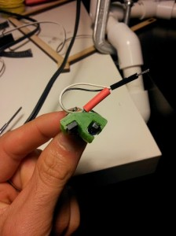
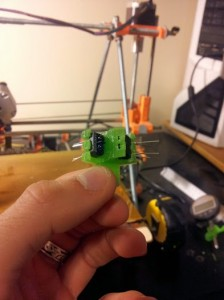
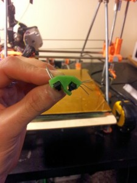

 

 

I update the reflective sensor to span 56.3 degrees, allow the sensors to ‘clip’ into the brackets, and had both sensors active on the same bit.    

 

ToDo: add a debounce to bed sense

Current routine: [http://www.youtube.com/watch?v=1hiDaT5D7kA](http://www.youtube.com/watch?v=1hiDaT5D7kA)

