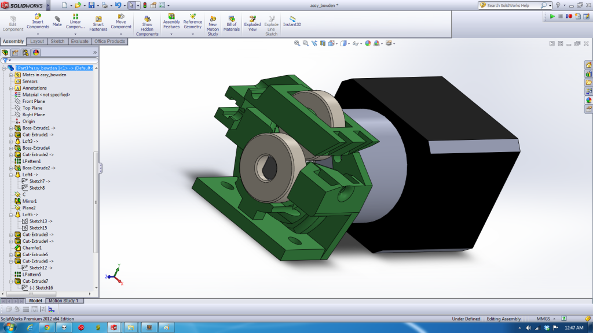

I found that direct drive extrusion with long bowden tubing created enough
torque to make my stepper motors skip with the standard Pololu drivers.  No
current adjustment would prevent the skipping.  Thus, I ordered some 5:1 geared
steppers.  Upon receiving my steppers, I found the bolt pattern was different
and the shaft diameter and length were different.  I have hence designed a new
extruder, similair to airtripper’s.

cOssel Bowden
