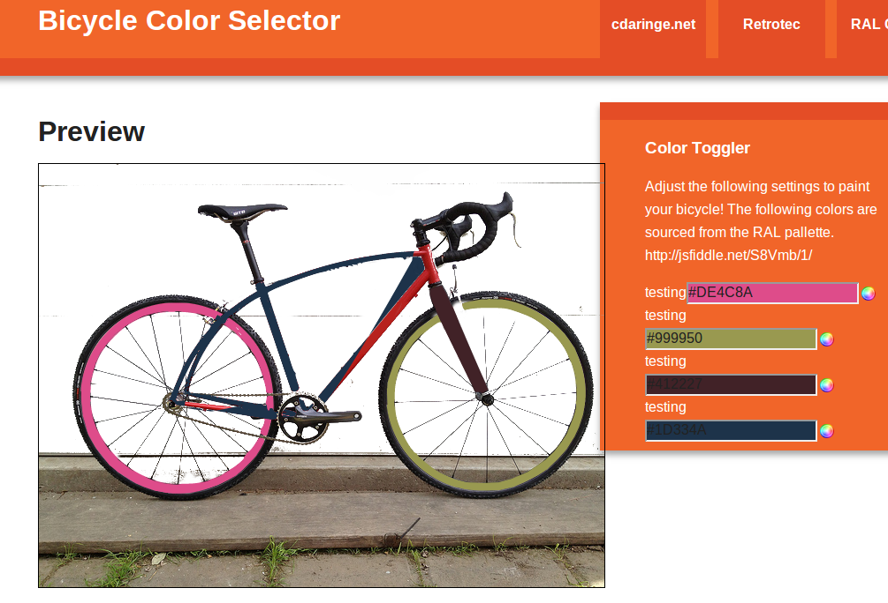

# custom bicycle painter

I’ve recently signed up to order an ultra-classy, retrotec custom bicycle.  Choosing colors for a custom bike is a tough prospect.  Thus, using fabric.js as a js canvas, a set of modified color pickers, and good old fashion jquery, I bring to you the 1st rev of the bicycle color picker!

**update** - I wrote this code a _long_ time ago! It's not my finest work. Nonetheless it works.

[http://static.cdaringe.com/archive/bikeColor/](http://static.cdaringe.com/archive/bikeColor/)

 Bike Color Chooser!
