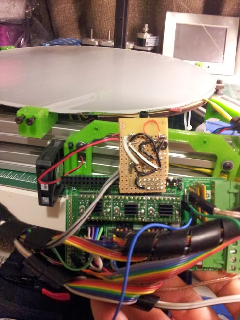

# Problem Statement

Many [RAMPS 1.4](http://reprap.org/wiki/RAMPS_1.4) users struggle to have all of
their desires filled with only three 12V ~high current PWM outputs on the board.
 In my case, they are already used for:

- Extruder 1 Heater
- Extruder 2 Heater
- Heated bed

Many of us would like an additional 1-3 fans to control as well.  Even more
outputs would be nice if you have a controlled chamber environment, which is
very uncommon.  Regardless, I **need** at least one controlled fan for print
quality, and one ‘always on’ fan to cool the stepper drivers.  I found
[an off the shelf extender board](http://www.reprapdiscount.com/electronics/25-reprap-ramps-14-fan-extender.html "this"),
but why pay when you can make it yourself?

# Solution

The solution is to use an excess 5V DO bit on the board for fan control. Your
RAMPS equips an Arduino MEGA 2560, which has plenty of extra I/O to spare. Wire
the fan to one of many hot 12V sources, and away you go. Of course, depending on
what bit you choose, you'll need to make sure there's no collision or existing
prescribed usage for that bit in your firmware source. Alternatively, be
comforable overwriting the default usage for the pin. The top rail of the board
is largely unused--I don't even recall what bit I picked! Regardless, with a few
resistors, a transistor, some extra protoboard, handful of header pins, and
basic electrical tooling, there's really not too much to this little board.

The craftsmanship could have been cleaner, however the design is functional
nonetheless.  Doug gets credit for doing the electrical sketch.

Wired up! The circuit to the left is a different project. Fear not--it shall be
cut off momentarily!

Now there’s a pretty fan!

