Feel free to jump right down to the [Instructions](#instructions) for pictures and HOWTO for the extruder assembly.

# Problem Statement
More than a year ago I published a [hi-torque extruder](http://cdaringe.com/cossel-new-bowden-extruder-design/), built for using geared NEMA steppers.  The design works, but it has some shortcomings:

1. The RP idler is weak, and with prolonged clamping stress, PLA & ABS idlers began to warp/crack.
1. The RP idler clamping mechanism is a bit goofy, requiring excessively long hardware, and overall is difficult to work with.

These issues have prompted me to revise the old extruder.  To my knowledge, there are no other direct drive geared NEMA compatible extruders available.

# Solution

1. Extend the old extruder body width to move the clamping screws away from the idler bearing.  This enabled the removal of the upper idler mass, and hence the need for mounting screws ~10mm longer.  The idler is now longer, flatter, simpler.
1. Thicken the idler body to consume the full width between the idler strut and main extruder body.
1. While we're at it, thicken the strut body as well.

An additional mounting hole was added, and clamp screw slots were improved both on the extruder and ilder bodies.

The problem statement issues have been resolved, and hence v2 is a much cleaner extruder.  There's still improvement to be had, but this is working well.

# BOM
If you are upgrading from my v1 extruder, will need no other parts other than all new RP.

#### RP

1. 1x RP extruder_cossel_bowden
1. 1x RP idler
1. 1x RP idler strut
1. 1x 8mm axle for idler bearing, such as [original airtripper axle](http://www.thingiverse.com/thing:35404/#files)

#### Motor-Extruder Hardware

1. 3-4x M3 x 5mm screws (button preferred, but SHCP OK)
1. 2x. 608 ZZ sealed cartridge 8mm ID bearing
1. Geared Stepper Motor
1. Filament drive of your liking.  *Note: the phidgets geared NEMA 17 motor shaft is **8mm OD***.  I had to bore my mk7 drive gear out!

#### Idler/Strut Mounting Hardware
1. 1x M3 x 25mm screw
1. 1x M3 x 30mm+ screw
1. 2x M3 nut

#### Filament Clamping Hardware
1. 2x M3 x 40mm+ screws
1. 2x M3 nut
1. 2x ~M3 diameter springs + washers for clean compression

#### Bowden Hardware
This is mainly up to **you**.  I used 5mm tube compression fitting and 5mm T slot nut (http://tinyurl.com/qy6rtkn) to secure the bowden 'filament output' in place.  

# Instructions

* Print all parts, clean up holes as required

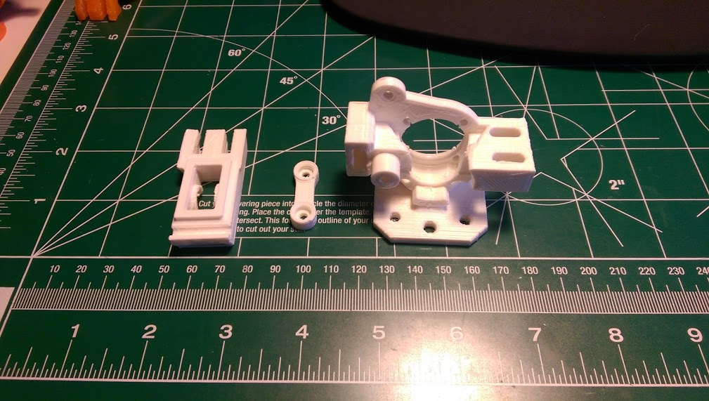
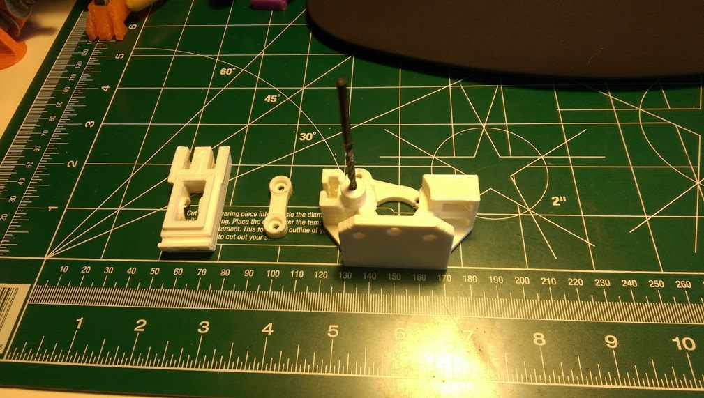

* Press M3 nut into back of main body (this is for the strut to latch into).  Mine presses in easily!  If not, try warming the nut with the soldering iron.  Use caution!

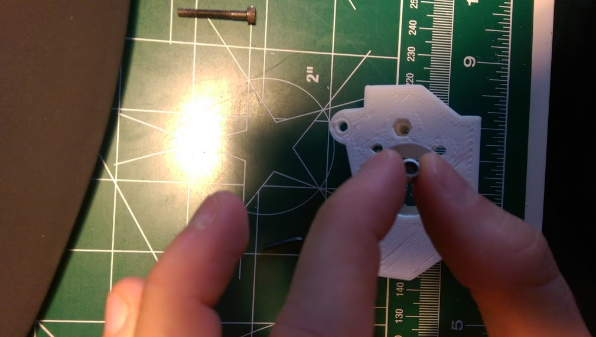
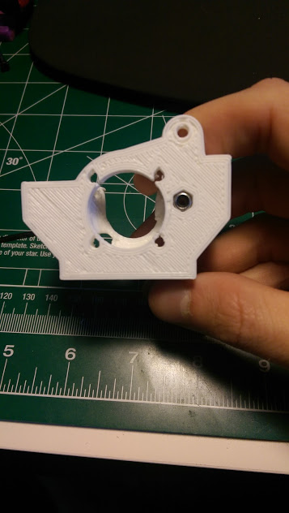

* Install the ilder strut to the extruder body with a M3 25mm screw.

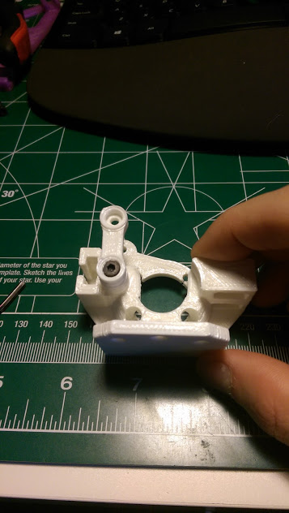

* Install the drive gear onto your extruder loosely.  To align the drive gear, I recommend placing the extruder body onto the motor, looking through the filament hole, and making sure that the drive gear grove is inline with the filament axis.

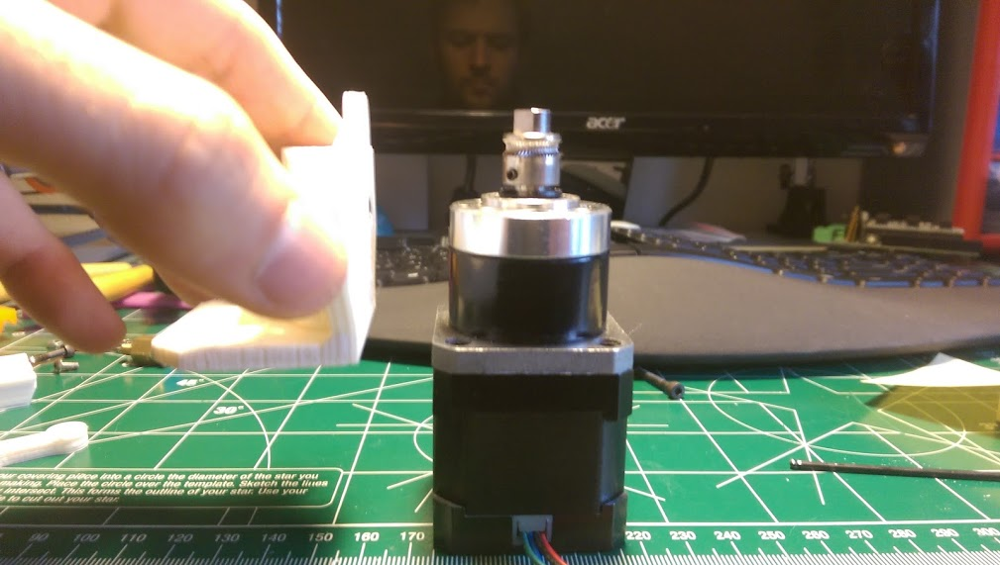
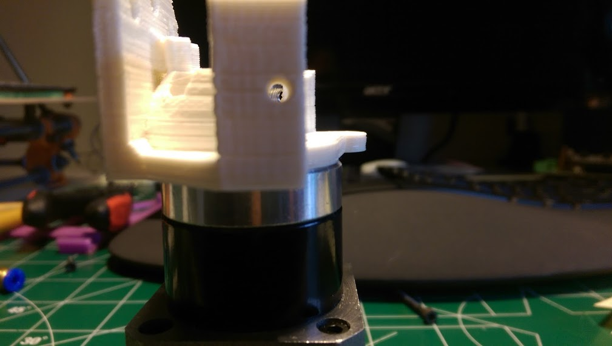

* Install the motor mounting screws into the extruder body.
* Hover the extruder over the motor, and engage the screws with the motor threads one-by-one. Keep the extruder loose on the motor.

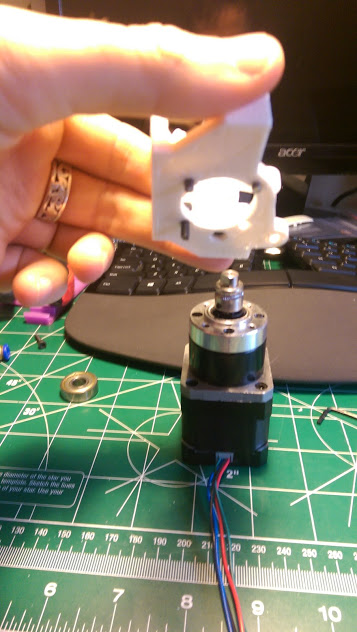
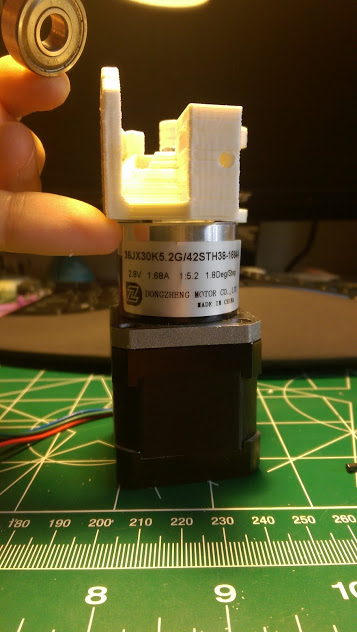

* Install the shaft support bearing.
* While pressing the extruder body towards the bearing & shaft, removing any potential slop, torque down your extruder M3 mounting screws.

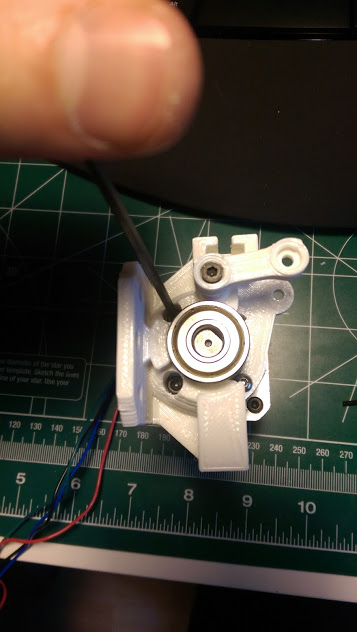

* Install the ilder axle & bearing into the idler.

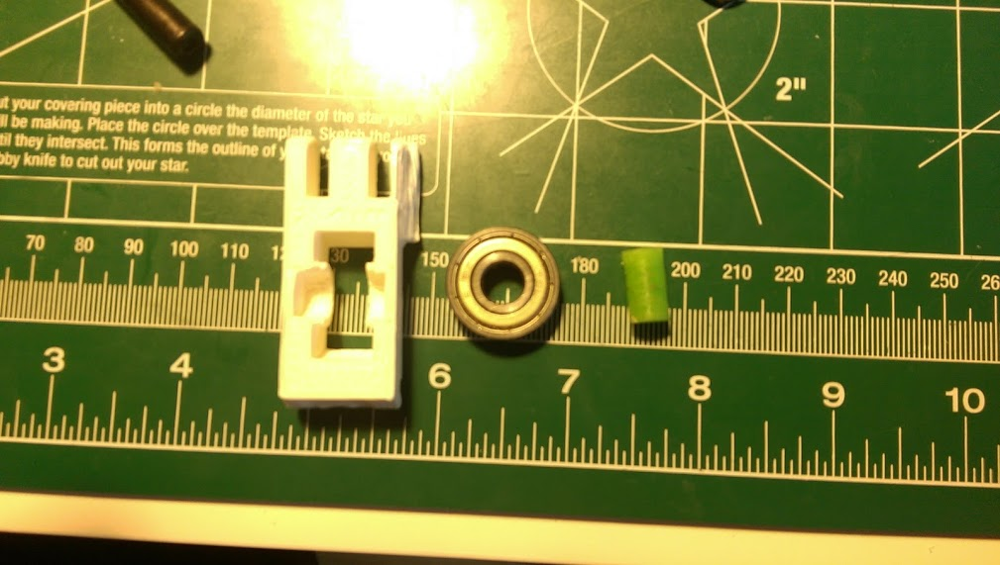
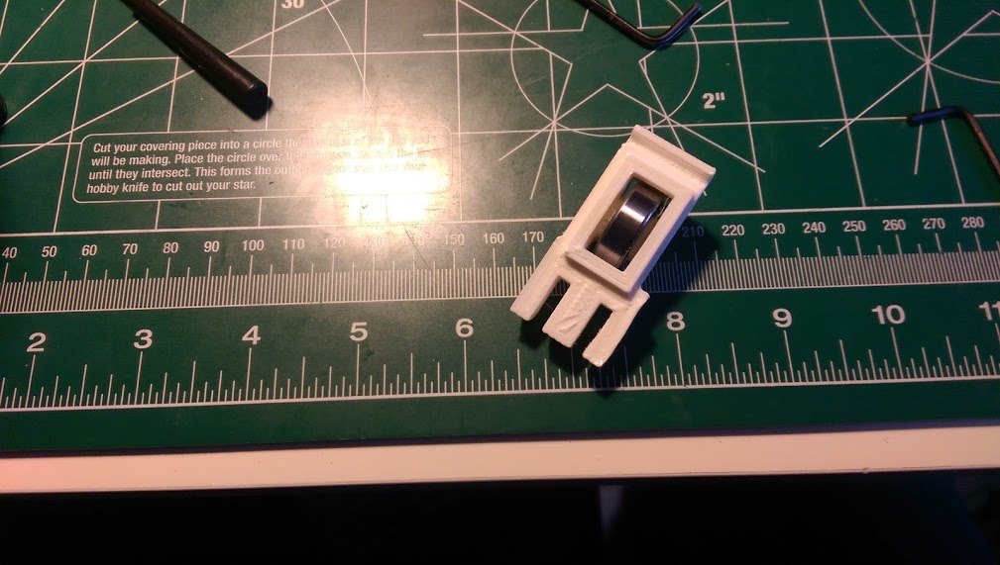

* Install the idler assembly to the extruder.  Simultaneously, install another M3 screw into the the ilder strut to secure the idler assembly.  Secure with M3 nut.

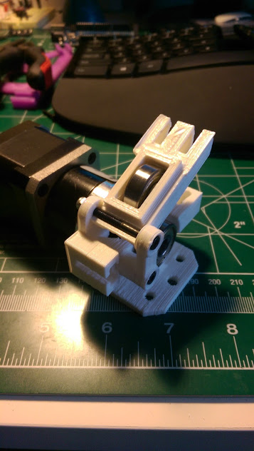

* Install idler clamping screws/springs/washers/nuts.  Mine don't look very pretty.  Hopefully you have some better fitting springs :).

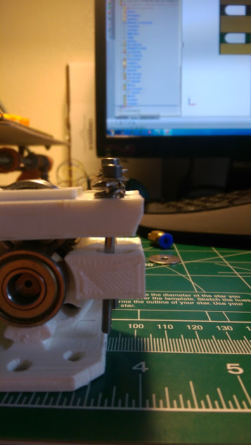
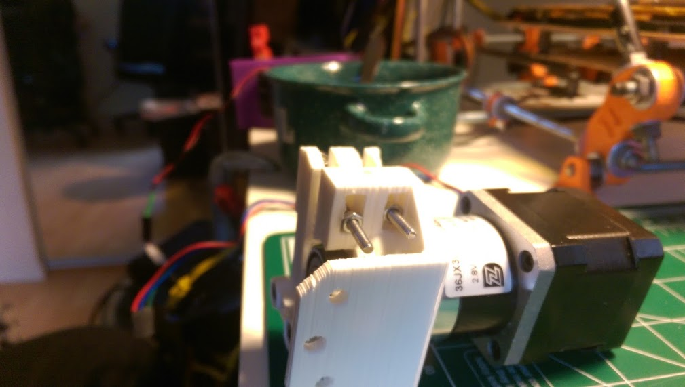

* Test slide some filament through your extruder to help you install your bowden *filament-output* hardware! 
  * The filament OUTPUT slot will fit M5 jam nuts, or 5mm extrusion beam nuts.
  * Thread your tube fitting into the nut.

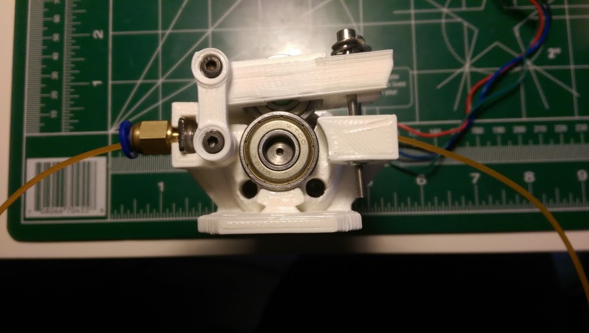

* Go print!

# Conclusion

If you have any questions, feel free to write me on thingiverse, preferrably the [extruder thing page](http://www.thingiverse.com/thing:621705)!

