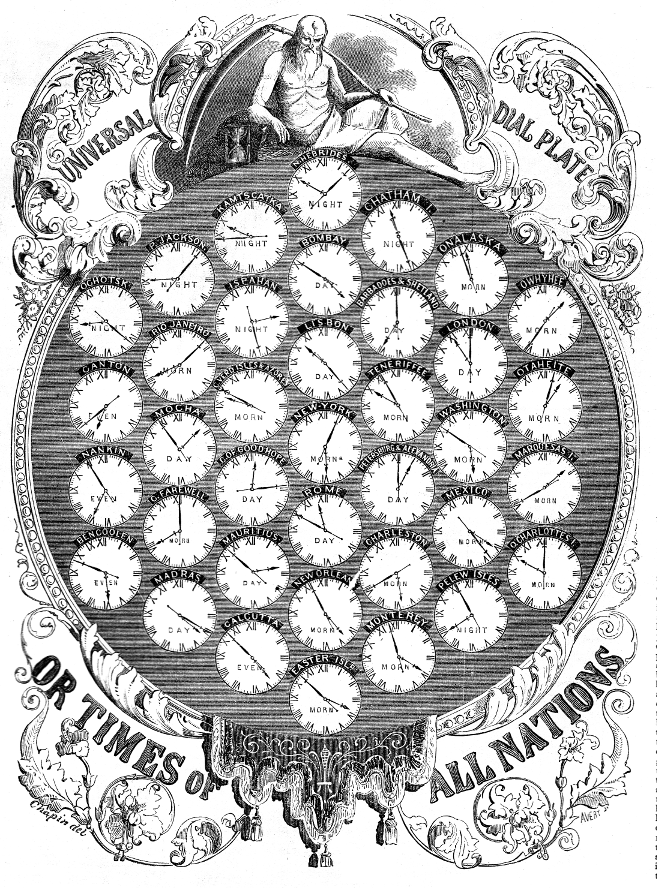

Managing date and times has long been trouble for every application developer.
In many cases, a simple app only cares about datetime resolution at the `day`
level. However, to many applications, higher time resolution is critical. In
these applications, a finer, more granular time-unit resolution may be highly
desirable. The difficulties in managing time emerge in the realm of relativity.
If an application, its users, and its dependent infrastructure are spread across
timezones, synchronizing a chronological history of events may prove difficult
if you haven't designed your system to manage time full well. This is discussion
may be old hat for many, but a painful reality for many apps.


## why is it difficult?

It doesn't have to be, actually. The "difficult" aspects of managing time are
generally designer oversight. Two common oversights that I am personally guilty
of are:

- Time is often captured incompletely. Application services consuming the
  incomplete time fill in the missing data with assumptions.
  - ex: in js, `(new Date()).getTime() //=> 1435089516878`. What happens if you
    log this time on a server in a different timezone? Most likely, the server
    uses its timezone or UTC, _not_ the user's time zone.
  - **Time is comprised of multiple data components: a geospatial component, and
    numeric count component**. It's easy to lose or forget-to-consider the
    geospatial component.
- Time is transferred in varying formats, generating sub-system overhead (or
  errors!)
  - How do you serialize your `date` or `time` objects for sending over the
    wire? Is your serialization lossy? Do your services require knowledge of
    each others' formats?

## how do we fix it

Before we discuss how these issues manifest themselves in an application, let's
quickly discuss the general solution. We need a solution to represent time that
does so reliably across:

- distributed application environments (e.g. languages, operating systems,
  clients)
- distributed application hardware
- client time zones

My preferred strategy is to **store, transfer, and manipulate complete
timestamps only**. What's a complete timestamp? It's simply an absolute time
with visual representation of timezone. It's a string or composite datatype
specifying time with my application's required time-unit resolution or finer, +
TZ. Practically speaking, in my app I will:

- store all database times as timestamp with timezone (or equivalent)
- transfer all times as fully defined time strings **with timezones** in a
  standardized format (e.g.
  [ISO 8601](https://en.wikipedia.org/?title=ISO_8601)). **Know your
  application's** time-wise resolution needs, and adhere to them throughout the
  app. Suppose you need `second` level resolution:
  - **bad**: '10/25/2010'
  - **bad**: '10/25/2010 08:23:22'
  - **good**: '10/25/2010 08:23:22-07'
  - **good**: '10/25/2010 08:23:22.2324-07' (note timezone _offset_ included)
- perform time operations only through utilities that can parse and understand
  the complete time strings. avoid manually extracting time components out of
  strings.

**EDIT, [Aug 2015]**

- **good**: '10/25/2010 08:23:22.2324' plus an additional TZ (e.g. 'PDT') field
  is more complete than a TZ offset, if the application requires it. Some
  TimeZones themselves are subject to wonky rules, as they are administered not
  by a global standards body, but rather local governments for a given region
  (thanks #cascadiajs)! I speculate that such resolution is inconsequential for
  most apps. For many apps, UTC time alone may suffice, and you merely render
  all times to the user's locale. However, that _is_ lossy, and may have
  consquences!

## application `date` and `time` oversights

We already discussed these above. Let's dive a bit deeper.

#### time captured incompletely

Earlier, we examined computing unix time in the browser, using javascript.

```js
var myDate = new Date();
myDate.getTime(); //=> 1435089516878`
```

The above is an easy way to get a time. Let us use this in our app, so long as
that time data doesn't leave this client, or this machine doesn't change
timezones. Can you assert that your user's don't travel? Can you assert that
your time or time calculations won't be sent somewhere, beyond the client? If
you cannot, sending time in a basic integer format drops critical data.
Specifically, you lose timezone relativity and, in rare cases, a known base-time
reference value. For instance, does that integer reflect the # of seconds from
unix-time-start in UTC time, or the # of seconds from unix-time-start, offset
for your region?

You could, as some do, use the above integer time value in conjunction with a
timezone string. However, you've introduced generally 1 to 2 steps of extra
parse complication on all services consuming your time values, and an unstated
assumption that the unix time provided is already aligned with UTC (it generally
is). These are all simple concepts that stack up to be a complicated when you
have many services in different languages. JS (node and browser), for instance,
default to milliseconds. PHP likes seconds.

Managing this complication is generally unnecessary. In order to convey a clear,
accurate, and complete timestamp, one of which that you can interchange safely
across services, serialize your apps' and services' timestamps in a complete
string during I/O, and parse via language natives or time helper libraries as
required.

```php
// client makes xhr GET request to server
xhr.get(..., cb);

// server responds (ex. php DateTime)
$datetime = new DateTime('now', new DateTimeZone('America/Los_Angeles'));
echo $datetime->format('c'); // 2015-06-24T09:45:06-07:00
 (ISO 8601)

// client parses. (ex. javascript moment.js)
var cb = function(response) {
	// response => 2015-06-24T09:45:06-07:00
	var myDate = moment(response);
    myDate.format(); // 2015-06-24T09:45:06-07:00
	myDate.toISOString(); // 2015-06-24T16:45:06.000Z
    // how refreshing!  all I/O could use `.format()`
    // as your serialized version, instead of `.toISOString()`
    // so as to not drop user TZ
}
```

This example leads us directly to our next topic!

#### time is transferred in varying formats

Look at your own applications. How have you shared times between services? Have
you echoed time values directly out of your database? Have your API's used
programming-language specific formatting functions to make time "look" standard
to your liking?

Apps I have worked in have done all sorts of variants in php:

```php
echo date("Ymd"); // or
echo date(DATE_RFC2822); // or
echo date("Y-m-d H:i:s"); // very prevalent in codebases i've used
echo date("c"); // my favorite :), e.g. 2004-02-12T15:19:21+00:00
```

[date("c")?](http://php.net/manual/en/function.date.php)

Use a standard. 8601 is my personal preference. Using a standard is generally
the safest, as most languages have a toolset that can parse and manipulate
dates/times from a standardized string. It is ideal to do date/time I/O in the
same string format on **every transfer** to make your interfaces predictable!

A consideration that **must not be overlooked is whether or not the timestamp
serializer normalizes to UTC or not**. In the server example directly above, we
used `date("c")`. This does _not_ normalize to UTC time. In the client example,
we advised against using `myDate.toISOString()` in favor of `myDate.format()`,
where `.toISOString()` normalized to UTC. Again, all of the above variations are
8601 compliant, but `.toISOString()` drops user +TZ data.

It can be OK for servers to send outbound timestamps normalized to UTC time if:

- we have a centralized server model (because we tend to normalize internally
  against UTC anyway) AND,
- our client apps/services don't care about client locale history

Those are tough bullets to gamble over. You may have not know how your app or
ecosystem will change in time. In a distributed server model, where server
activity also needs to be tracked against other servers, UTC normalization may
lead to bad consequences! **Don't normalize to UTC if you have rich TZ data to
begin with** and there is possibility that you will want to maintain client
locale time in any part of your app!

#### summary

It's easy to drop critical time data. It's also very easy to maintain good
timestamp data integrity. When possible,

- clear understanding your app's timestamp requirements,
- use a timestamp standard,
- avoid time normalization, and
- practice lossless timestamp serialization and parsing.

These tips will help yield a healthy app and good time intgrity. It's a bland
topic--thanks for reading!

[moment.js](http://momentjs.com/)<br>
[php DateTime](http://php.net/manual/en/class.datetime.php)<br> Note:
[FF bug: Date.parse doesn't honor valid ISO str](https://bugzilla.mozilla.org/buglist.cgi?quicksearch=Date.parse&list_id=12345854),
hence moment.js usage for unified x-browser time-parsing experience!
