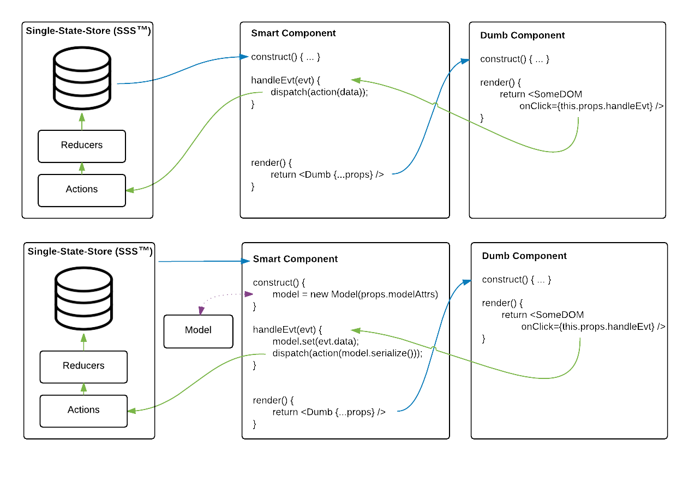

---
title:
  "A defense for sub-modeled state with a Single-Store-State application
  structure"
slug: "/a-defense-for-sub-modeled-state-to-throttle-and-protect-the-single-store-state-model"
date: "2015-09-24T04:37:10.000Z"
featured: false
draft: false
tags: []
---

## context

[@danabramov](https://github.com/gaearon) recently took the JS community by
suprise by proposing a radically simple idea for defining application state. A
single, simple, serializable object could define the state for an _entire_
native web application. That is to say, plug a state object into your app and it
should be able to render perfectly into that state. State becomes immutable in
this strategy, and we re-render on state changes.

Most of us web developers are very familiar with maintaining state all over the
place. For example, we often maintain state in controllers, in the DOM, and even
in the `window`. For some of us, we even maintain state in objects that are
designed entirely to maintain state. Think
[ampersand-state](https://github.com/AmpersandJS/ampersand-state) or
[backbone Model](http://backbonejs.org/#Model). The proposal to use a single
store of state, hereby **SSS** (because why not!), is an intuitive and desirable
condition for developers to have in their app.

## challenge

If we buy into the immutable proposition for our native web apps that Dan
proposes, does that mean that there's no room for our existing tools?

As often the case, the answer to above question depends on the rules that the
developer or team decides. I'm a big fan of ampersand-state, so I will speak in
the context of that. For those who are not familiar with it, let me elaborate on
some of its features. Let's see how it was used traditionally before I propose
how it can be used in the context of a SSS application. If you are familiar with
backbone Model, ampersand-state overlaps heavily, so please feel free to skim!

### ampersand-state as a data modeler

From the docs:

> ampersand-state: An observable, extensible state object with derived watchable
> properties.

Pretty simple definition. Nothing immediately raises red flags that says this
tool violates a [redux](https://github.com/rackt/redux)-like pattern, beyond the
word "state" itself. Let's talk about some major features as they pertain to
data-modeling and application interaction:

- defined, assertable properties
  - you can specify properties on your data-model. Let's use a `File` as an
    example. I can define `size`, `sha`, and `pathname` as attributes. I can
    declare their types, and mandate that they are present. What value does this
    give me?
    - Validation, attribute-definition-wise. No required value can be left out
      due to user forgetfulness, API changes, etc.
    - Validation, type-wise. If `size` is a number in kilobytes, it will Error
      out if I accidentally enter string.
- derived attributes
  - composite attributes that are computed based on other bits of the Model
    definition. I commonly use [PouchDB](http://pouchdb.com/), which requires a
    unique `_id` when putting data into the database. In the `File` example, I
    really want to make sure that I don't put the same file in twice. Therefore,
    I specify `_id` as a derived attribute to proxy `sha`. There are other ways
    to handle this, but boy, that was easy!
- custom serialization
  - ability to convert your Model into a raw JS object ( customizable).
- collections
  - yields powerful set operations over Models, or raw data. Sometimes basic
    array operations just _aren't_ enough to efficiently meet your needs. I'll
    let the
    [ampersand-collection](https://github.com/AmpersandJS/ampersand-collection)
    API speak for itself.
- eventing
  - a killer eventing system is built in, so you can deploy actions based on
    model changes

These are only _some_ of the features it offers. This isn't an article on
&-state though. Per review of the above, you can see that pre-2015-bleeding-edge
tooling exists to give your data structure and power. These are _useful_
features that I shouldn't dispose of. The immutable app model proposed by
`redux` has a simple mantra--let state be expressed in a simple store. Is there
a way I can still exploit the benefits outlined above, but not let my Models
define the actual application state? **Yes**, I argue that you can.

## data models in the redux flow

**Let your data models be intermediaries.** To best see this in action, let's
study the following two diagrams. The _TOP_ is the default `redux` flow. The
_BOTTOM_ is the _redux_ flow using models as an intermediary data model, such as
&-state.

Consider the bottom image. State is read from the store, then _some bit of that
state_ may be transformed into a rich Model object (see the constructor). The
`props` to my smart component are still passed to the dumb component as usual.
The key difference is that UI changes that impact your data-models now don't go
directly into the app-state via actions. Instead, UI events that result in
data-model state changes first get set into the model, and then actions consume
data from the data-model, not the event. Your model must provide a one-way flow
from the UI into actions/actionCreators. You should almost _never_ have to pass
your data model down to your dumb components, otherwise you may have missed the
point. There may be cases where your dumb components need access to a derived
attribute from your model. These cases can often be prepped in your smart
controller and passed through via composition.

### weaknesses of the no-model flow

"OK. They both methods achieve the same end goal, but your method is more
expensive. I still don't see the advantage," you say. Consider if you have
multiple views. One view is for uploading the `File`. Another view allows people
to tag the `File` with data. In the simple approach, a user in one view may
dispatch an action setting the `File`'s state to have a `file.sha`, but in the
other view someone may set `file.fileSha`. Assuming both state updates were
dispatched, both `sha` and `fileSha` exist in state, redundantly. A rigid
data-model prevents that case from existing. Additionally, if you are
referencing a computed value such as my `_id` example earlier, updates incurred
because of dependent value changes happen automatically. I don't need to
manually apply the recalculation logic in both view controllers--the model does
it for me, and when I dispatch an action with my serialized model, I know I'm
getting the latest and greatest.

Here's another example of that failure mode. Suppose `path` is a composite
property of `dir` and `filename`. If one view updates `dir`, but _forgets_ to
update `path`, you're in trouble! Cases like this could handled while
`select`ing the component state to compute the derived value. Also a memoized
getter on `path` _could_ sometimes work. However, **you have now defined Model
definition logic inside of your controller. Boo! Yuck!** Similarly, the
validation steps discussed above (e.g. protect against crufty attrs like `sha`
AND `fileSha`) could take place in the _action definition function_. A weakness
of that strategy may be performance penalties or unnecessary complexity,
especially given the case where you are just intending to patch model attribute.
We won't dive further into that!

### weaknesses of the model flow

There are weaknesses in my proposed strategy.

1.  <strong>memory</strong>. you've defined _duplicate_ state for models that
    are persisted to the single store. Synchronization between these duplicate
    state objects may appear like a threat, but if you are rendering _nothing_
    from the data-model's state, your rendered state is still a true reflection
    of the one-source-of-truth.
1.  <strong>performance</strong>. you're adding the overhead of model-wise
    validation _and_ serialization of your model every time that it changes via
    the UI.

I have found neither of the above weaknesses to be a significant performance
hit. In profiling a slow application, CPU times in my model internals were not
visible in the "CPU-%-by-fn" sorted list. All model internal times were easily
dwarfed by React internals, controller activity, and utility fns. Of course, if
I start to render huge datasets, I may need to adjust my strategy slightly. I
have also been diligent about purging unused state in the SSS by hooking into
React lifecycle events, primarily `componentWillUnmount`.

## summary

- Formal Model definition structures provide great value
  - examples of that value are validation, collection operations,
    composite/derived properties, and eventing
- Historically, Models have been used to represent application state. However,
  they instead can act as intermediaries to retain their features in a SSS app.
- Models add overhead to your application as state is duplicated for the sake of
  added functionality. This should be considered before you begin using them!
