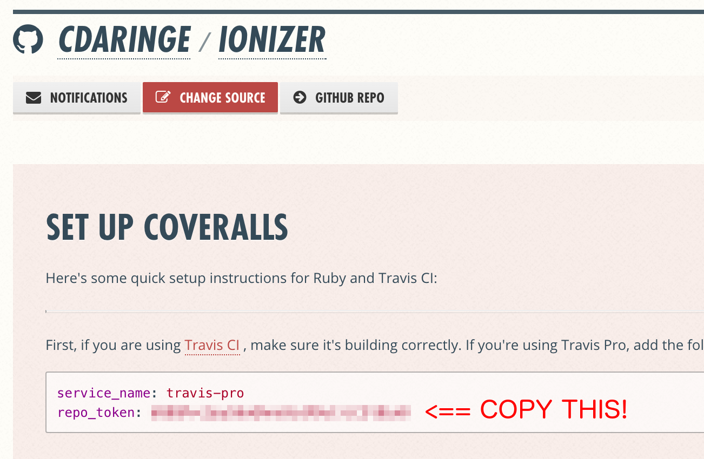
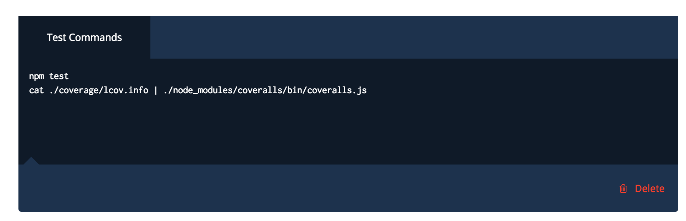
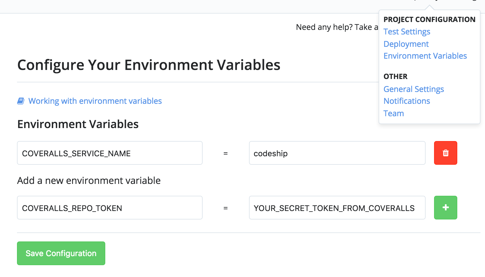
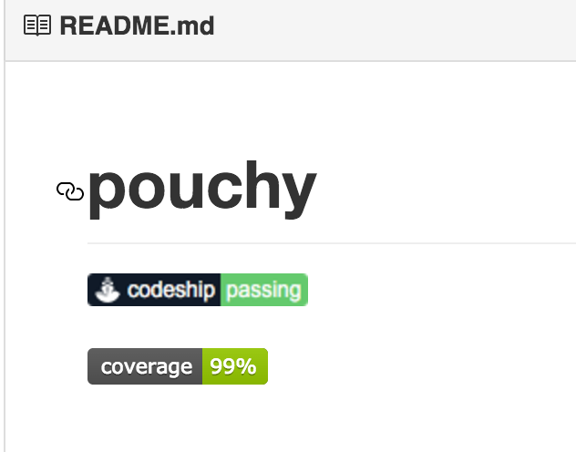

[coveralls.io](www.coveralls.io) is great. however, the default instruction sets
are tailored to ruby and travis. i use neither.

for many of us, we want coveralls to work with [codeship.io](www.codeship.io)
and [nodejs](www.nodejs.com).

the coveralls docs re-direct you to:
https://github.com/nickmerwin/node-coveralls, which helps us get the job done.
however, you may like just a simple clear step-by-step.

Here are the steps, short and sweet:

- `npm i --save-dev coveralls` into your npm project
- make sure that your package's test scripts generate coverage documentation
  - for example, i have the following npm scripts in my packages:

```json
// package.json
{
  "name": "MY-MODULE",
  "description": "A SUPER GREAT MODULE",
   ...
  "scripts": {
    "test": "nyc --reporter=lcov --check-coverage --functions=90 --branches=90 node test/"
    }
}
```

- setup your project in coveralls.io
  - log on, follow the add repo instructions (can't miss 'em)
  - copy and paste the secret token--we need to enter this in your codeship
    build process



- visit your project on codeship

  - open the test commands enter the following:

```js
npm test # or your test command
cat ./coverage/lcov.info | ./node_modules/coveralls/bin/coveralls.js
```



- open the environment settings, and set the following keys:

```bash
COVERALLS_SERVICE_NAME=codeship
COVERALLS_REPO_TOKEN=YOUR_SECRET_COVERALLS_TOKEN
```



- assuming that you have linked your git project with codeship, simply commit
  your changes to your package and push!
- don't forget to add a pretty little badge to your README! you can copy the
  markdown syntax from with within your project settings on coveralls.
  - please note that it may take a couple of minutes for your badge to render
    successfully!



You're all done!
