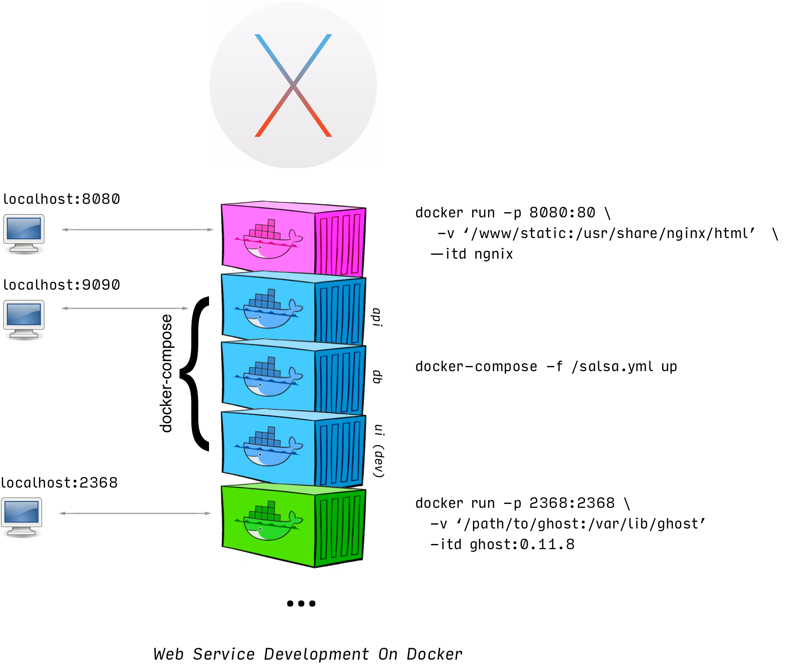
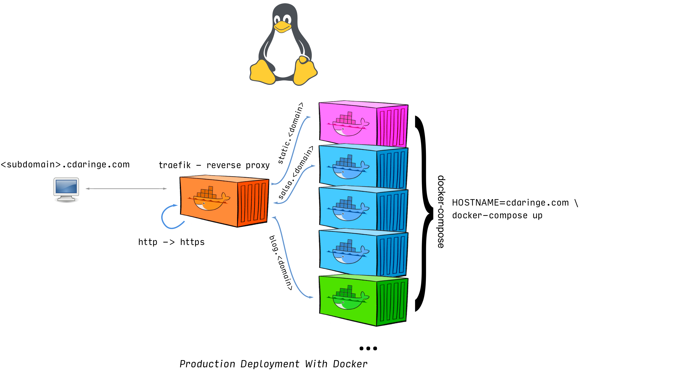

Deployment of web applications and services can be difficult.  It is often a maze of carefully aligning assets, pulling down & configuring executables, wiring up storage, fidgeting with networks, and more IT/DevOps tasks than most of us care to enjoy.  I have experienced these difficulties enough that I pursued a new deployment strategy to ease my pains.  Here's how I did it.

## context

For years, I have shipped my software services manually.  In other words, I would ship `some_service` by executing `scp -r ./my-some_service ...` to `some_server` on the internet, and configure it remotely.  Both application & system dependencies would be installed/compiled/linked/etc on that single server. It's a completely valid approach to shipping software at the hobbyist level.  However, it's certainly not very repeatable, nor is your service portable.  These two properties become increasingly important as your number of services increases, even for the hobbyist!  Needless to say, I had many snowflakes ❄️ floating about, & upgrading to a new server was a headache.

For perspective I had manually deployed a handful of apps/services to a single server, including:

1. a hand-crafted nodejs reverse proxy
1. _this very blog_
1. an instance of [greenkeeper-keeper](https://github.com/greenkeeper-keeper/meta)
1. a static content server
1. [senorsalsa.org](http://senorsalsa.org)
1. [redorgreen.org](http://redorgreen.org)
1. an interactive npm tutorial (retired!)
1. a prototype [PDM](https://en.wikipedia.org/wiki/Product_data_management) app
1. my soccer team roster & RSVP app
1. a fun little bicycle paint-job visualizer widget
1. ...and a few others


It's arguably _enough things_ to have some automation for deployment in place.  It's also arguably the right amount of things _to start worrying_ if services step on each other.  And in fact, services _did_ start stepping on each other.  For instance,  the [ghost](https://ghost.org/) blogging engine requires nodejs version 4.x, senorsalsa.org requires nodejs 6.x+, & redorgreen required 7.x+.  Tools like [nvm](https://github.com/creationix/nvm) (like python's [venv](https://docs.python.org/3/library/venv.html)) let you work around this particular issue.  However, this is just one example of many of conflicts.

Portability was weak for these apps, & repeatability for deployment suffered.  `docker` promises to alleviate these headaches, so I went in deep & dockerified all-of-the-things.

Let's get these apps deployed with ease.

<iframe src="https://giphy.com/embed/FM8jIaqaAEG8E" width="480" height="397" frameBorder="0" class="giphy-embed" allowFullScreen></iframe><p><a href="https://giphy.com/gifs/clash-of-clans-coc-fish-hook-FM8jIaqaAEG8E">via GIPHY</a></p>

## requirements

- all services shall run in docker
- one command shall push a local service to be running live in the cloud
- apps & services should be simple to onboard or remove

Additional considerations:

- a single server is _ok_
- 100% uptime is not critical, but would be nice :)
- scale? not critical.  this is for the _hobbyist_ for crying out loud!

How to docker-ify your services is fun, but is well covered elsewhere on the webs.  We're here to focus on deployment, so that content will be omitted.

## deployment strategy

To understand how we need to deploy, it's good to understand _what_ we need to deploy.



The above shows a loose approximation of some services I have running on my OSX development machine.  You can see that each service is runnable via docker, and exposes itself somehow to the network.  Here we see a nginx container on :8080 acting as a static file host, the dev version of senorsalsa.org exposed on :9090, and the dev version of this blog served on :2368.  Each of these applications was launched manually from my shell.

What should the production deployment look like?



The takeaway is we only expose some apps & containers through a reverse proxy, who will also handle our traffic encryption.  This enables us to only have to secure our server in one spot, versus in every app.  It also gives us great routing rules, letting us partition our subdomains nicely against specific apps!

### tech selection

Kuberenetes, mesos, terraform, vagrant, chef, AWS, Azure?  Woe is me!


Despite an intimidating myriad of tooling, I had clear requirements to meet.  My strategy for selection was to evaluate how well each toolchain (or combination of toolchains) fit the aforementioned requirements.  Let's discuss just a couple.

~~ **k8/mesos** ~~
The big players in container orchestration are known to have a high learning curve.  Further, having worked with k8, there's also a moderate amount of config & boilerplate to kick-everything off.  The google team on kubes is working hard to lower that barrier to entry, but for me--the hobbyist--this is too much cognitive overhead to onboard.  So, the big orchestration tools are out (k8, mesos, etc).

**ansible**

I know that some initial provisioning must happen each time I want to boot a new box, either on prem or in the cloud.  This has to happen _before_ I even consider putting my own applications on a machine.  For instance, install `docker`, `vim`, [`ag`](https://github.com/ggreer/the_silver_searcher), etc.  Additional tasks would be to lock down SSH (e.g. disable password login) or to configure a firewall.  Because I will undoubtedly need to do some basic, non-frequent maintenance, I rigged up some [ansible](https://www.ansible.com/) scripts to achieve these bootstrap steps.  `SSH`+`sh` could suffice for these operations as well, but I will come back to ansible later  to discuss additional usage & benefits.  Chef, puppet, or any other general purpose provisioner would surely work equivalently well here.  Regardless, `ansible` is now part of my deployment stack.


**docker-compose**

Only about half of my web applications are a single image/container.  Many apps are composed of 2+ containers, working together behind the scenes.  Most of the time, to run an app in development, I use `docker-compose`.  `docker-compose` solves a couple of difficult steps in container deployment:

1. ease of container networking
1. container boot order
1. container daemon policies

There's no way I will be writing `upstart`, `systemd`, or `sysv` service files again.  Docker eats all of that complexity away for us, and lets us declare these behaviors easily through compose.  For example:

```yaml
# docker-compose.yml for https://redorgreen.org
version: '2'
services:
   redorgreenapi:
    image: cdaringe/redorgreenapi
    environment: # it gives us fine control of our ENV
      NODE_ENV: production
      DB_HOST: redorgreendb
      DB_PORT: 5984
    depends_on: # it lets us specify boot order
      - redorgreendb
    restart: unless-stopped # it gives us daemon tuning

  redorgreendb:
    image: couchdb:1.6.1
    restart: unless-stopped
    volumes:
      - '/path/to/db:/usr/local/var/lib/couchdb'
# AND, it lets each container access each other by service name, as though they were hostnames.  e.g. `curl redorgreendb:5984` would successfully connect if called from the `redorgreenapi` container
```

`docker-compose` is now in the deployment stack.

**nginx-proxy**

A major consideration in deploying webservices is _how to expose them_.  If you studied the target deployment diagram above, you will have seen a reverse proxy in front of all of my apps.  **I'm not interested in the underpinnings of a reverse proxy--I just want something that works, and that is relatively plug and play.**  [jwilder/nginx-proxy](https://github.com/jwilder/nginx-proxy) is an awesome project designed for hobbyists like you and me!  It:

- fires up a nginx server
- watches the docker daemon
- on add/remove of a container, it dynmically adds a new reverse proxy config to that container
- lets you access that container via subdomain/domain matching rules

Cool.  Benefits?

- no downtime as you want to add/remove services
- no manual _nginx_ configuration
- easy to deploy alongside all of your other containers!

Unfortunately, there are a ton of bugs.  Also, the user-experience is lacking, which we won't dig into.  Kudos to jwilder for pioneering the effort, but too many hours were eaten trying to get this to play nicely.  I only mention this project because it was the first I heard about that offerred first class, dynamic docker support!  About when I was ready to give up and build a good-old-fashioned apache `httpd` image, another `jwilder/nginx-proxy` fan clued me in on `traefik`.

**traefik**


[traefik](https://traefik.io/) is everything `nginx-proxy` was supposed to be and more!  With minimal effort, minimal config, and minimal time, I had a feature rich reverse proxy running.  Let's study some code.

Here's my whole config:

```toml
# traefik.toml
logLevel = "DEBUG"
defaultEntryPoints = ["http", "https"] # fear not, we redirect to https below

[entryPoints]
  [entryPoints.http]
  address = ":80"
    [entryPoints.http.redirect]
      entryPoint = "https"
  [entryPoints.https]
  address = ":443"
    [entryPoints.https.tls]
      MinVersion = "VersionTLS12"
      [[entryPoints.https.tls.certificates]]
      CertFile = "/path/to/cert.crt"
      KeyFile = "/path/to/key.key"

[docker]
endpoint = "unix:///var/run/docker.sock"
domain = "some.domain"
watch = true
```
In 20 lines, I've told traefik to:

- redirect http to https
- handle all https at this layer only
- listen to docker, and support onboarding of proxied applications with containers

<iframe src="https://giphy.com/embed/QEstLyTuWawxO" width="480" height="327" frameBorder="0" class="giphy-embed" allowFullScreen></iframe><p><a href="https://giphy.com/gifs/QEstLyTuWawxO">via GIPHY</a></p>

Not too shabby!

So, how do I add a service?  In production, I use a single `docker-compose.yml` file, wherein **all of my services are declared**.  If a service needs to run, it has to be declared into that file.

```yaml
# docker-compose.yml
version: '2'
services:
  traefik:
    image: traefik:1.2.3-alpine
    command: --docker --docker.domain=$HOSTNAME
    ports:
      - "80:80"
      - "443:443"
    volumes:
      - /var/run/docker.sock:/var/run/docker.sock
      - ./traefik.toml:/traefik.toml
      - /path/to/certs:/path/to/certs
    restart: unless-stopped
  blog:
    extends:
      file: /path/to/blog/project/docker-compose.yml
      service: blog
    environment:
      NODE_ENV: production
    restart: unless-stopped
    depends_on:
      - traefik
    labels:
      - "traefik.backend=blog"
      - "traefik.frontend.rule=Host:$HOSTNAME,blog.$HOSTNAME,www.$HOSTNAME,www.blog.$HOSTNAME"

  ...other services...
```

In order to know how and what to proxy, `traefik`, in docker-mode, looks for `labels`.  `traefik.frontend.rule=Host:$HOSTNAME` tells traefik that when a request comes in for say, `Host:cdaringe.com`, to forward that request to the `blog` service.  You'll note that I match on many different `Host`s.  Of course, `traefik` also lets requests be matched on _other_ criteria as well.  I didn't need any :).

That's it!  Using ansible, docker, docker-compose, and other universal *nix-ish tooling, we can do single machine, multiservice deployments.

### deploy workflow

Let's suppose I want to add a new app.  For realism sake, let's suppose that the app needs to write to disk.  Suppose the app is called `whoareyou` (because we've all seen enough `whoami` apps).  The app will be a simple server that writes the visiting users' IPs to disk.  Here's the workflow, high level, top to bottom:

1. create app
  1. add the logic and dockerfile to a project dir, such as `/projects/whoaareyou`
  1. sym link `/www/whoaareyou` to `/projects/whoaareyou`
     1. all projects will be deployed to `/www` in production as a means of convention, so making this symlink enables me to run a "mock production", if desired.
1. add a supporting `ansible` script to copy project assets to `remote-host:/www/whoareyou`, and run a `docker build -t cdaringe/whoareyou .`, only if necessary
1. update the system wide `docker-compose.yml` file
  - specify `traefik.frontend.rule=Host:whoareyou.$HOSTNAME`, so `traefik` picks it up
  - specify a volume to mount, mounting `/www/whoareyou:/path/to/in-container-app`, so our data is persisted (& backup-able) on our remote server
  1. run `HOSTNAME=localhost docker-compose up` to do a test run!  hitting `whoareyou.localhost` should write your IP to disk!
1. execute `ansible-playbook`, which will sync up files, build images, and start or restart the `docker-compose` command bringing up all of our apps!

And that's it.  There is certainly room for more improvement.  However, for now, I've met my requirements, and feel confident that incremental changes can be deployed sanely and reliably!
