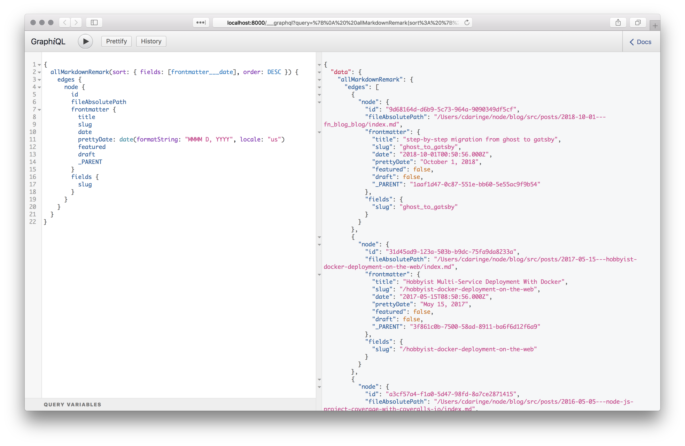
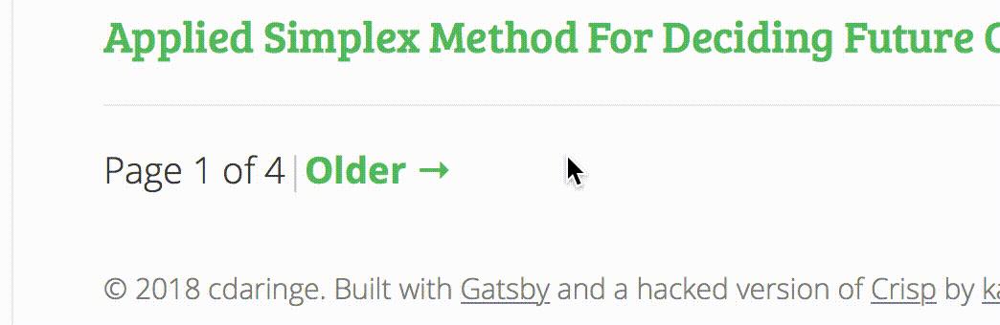
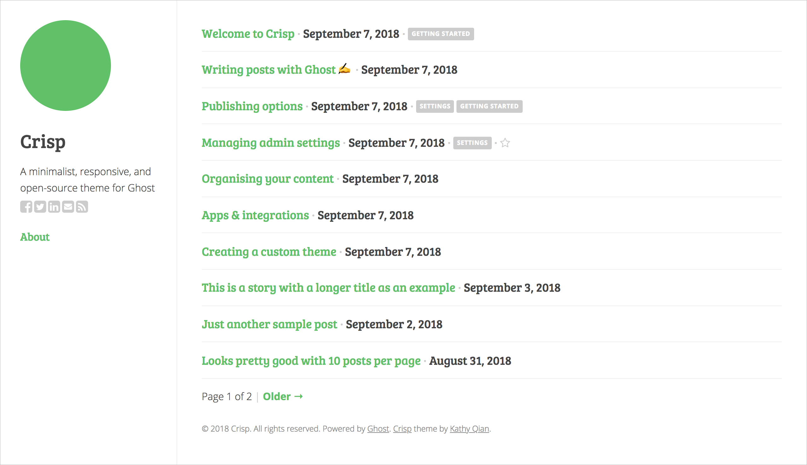
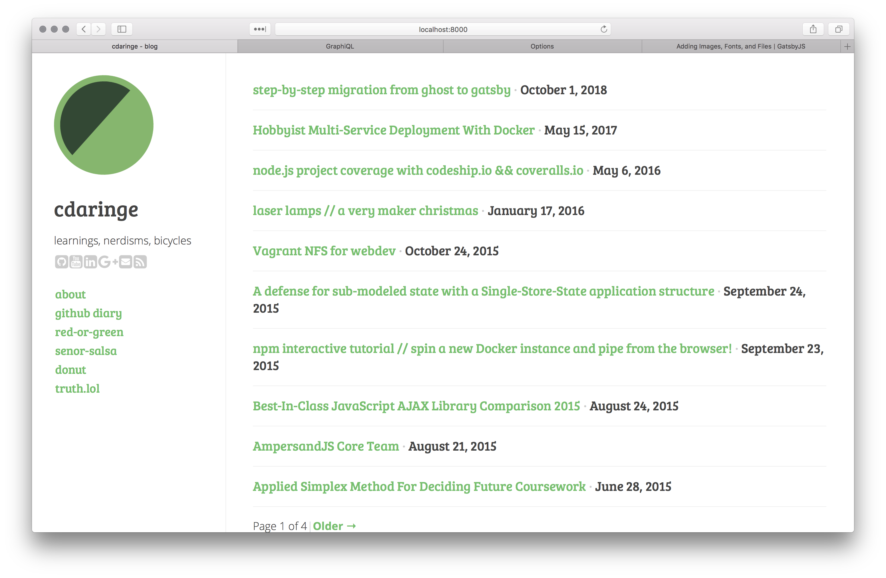

the latest code discussed in this post may [be found here](https://github.com/cdaringe/blog).

- [introduction](#introduction)
- [migration](#migration)
  - [capture](#capture)
  - [convert](#convert)
  - [configure](#configure)
    - [import posts](#import-posts)
    - [creating page entries](#creating-page-entries)
  - [design](#design)
    - [`<Layout />` component](#layout--component)
    - [`<Post />` component](#post--component)
- [conclusion](#conclusion)

## introduction

the following post describes a workflow for migrating a [ghost](https://ghost.org) blog to a [gatsby](https://www.gatsbyjs.org) blog.  before we jump into code, let us quickly review what both of these tools are.


`gatsby` is a _fantastic_ static site generator.  _TL;DR_, it allows you to design static websites using [react](https://reactjs.org), whilst ingesting content from a variety of different input sources--e.g. markdown files, remote apis, json docs, etc.  it exposes your data at development time via graphql, making it easy for you to query and scaffold your components before they are compiled down to static assets. there are many great static site generators in the wild, but building in react paired with graphql, versus `<some-other-templating-dsl>`, launches gatsby above and beyond the competition.  gone are the days of jekyll, hugo, or CRA-based blogs.


`ghost` is a blogging/content-management platform, which has been used by this website for a few years.  although blogs generally serve static documents, ghost is a server application, not merely a collection of static files. when a user visits a ghost blog, the ghost server builds up a HTML document real-time for each article request.  consequently, ghost requires a runtime (`nodejs`), a database, and a moderate amount of compute power (often 100MB+ RAM--yikes!).  i'm on a mission to lower my compute footprint for all of my hobby projects.  consequently, i decided to move my ghost content to statically servable content.  because [i already have `nginx` serving static files behind my reverse proxy](https://cdaringe.com/hobbyist-docker-deployment-on-the-web), i already have the infrastructure in place to serve a static site.

now that we know what we're dealing with, let's do it!

## migration

migration follows a linear series of steps:

1. **capture**. export all ghost content.
2. **convert**. migrate ghost content to a gatsby friendly friendly.
3. **configure**. tell gatsby how to digest posts.
4. **design**. create the gatsby site components.  ill be making mine look and behave like my old site.

all of the following steps assume you will be migrating your content in a new directory called `blog`.

```bash
mkdir ~/src/blog
```

### capture

ghost makes it stupid simple to backup your blog to a giant JSON file.  see the instructions [here](https://help.ghost.org/article/13-import-export).  it's quick, easy, and a short read.

download your JSON file and place it in your blog directory.

```bash
mv ~/Downloads/ghost-export.json ~/src/blog
```

### convert

as it stands, your export is just a `json` file with post content, but it's missing image assets, and isn't in a workable form if you intend to edit to old posts. thus, we will run a command to transform that JSON file into a set of folders containing your posts and images.

- install [nodejs](https://nodejs.org), if you haven't already
- create a folder to drop your new content into: `mkdir -p ~/src/blog/src/posts`
    - i put my post content into `src/posts` to discriminate against other content types, e.g. `src/pages`, etc.
- run `npx ghost-to-gatsby ~/src/blog/ghost-export.json --out-dir ~/src/blog/src/posts`

great! go ahead and take a peek inside of those generated files.  here's an example snippet:

```yaml
# src/posts/2016-01-17---laser-lamps-a-very-maker-christmas/index.md
---
title: "laser lamps // a very maker christmas"
slug: "/laser-lamps-a-very-maker-christmas"
date: "2016-01-17T14:49:26.000Z"
featured: false
draft: false
tags: []
---


files and bill of materials for this blog post may be found on github @ https://github.com/cdaringe/laser-lamp ...
```

you will see that in `yaml` style, this markdown document has some frontmatter.  neat.  we can use this section in gatsby to control metadata about our posts.  `ghost-to-gatsby` auto-generated this content for us.  i didn't change mine at all, but edit it as you see fit.  it's worth noting that the conversion tool didn't translate my content 100% perfectly.  some images were not downloaded, and i had to inspect each article in gatsby for a quick smoke check downstream to discover the problems.  the only fixes i needed to do was re-download images from my ghost blog, and patch the markdown files with relative paths to those images.

### configure

it's time to setup gatsby. gatsby has _killer_ documentation, and it would be foolish to try and cover it here.  i'm going to assume that you have [installed gatsby](https://www.gatsbyjs.org/docs/) into your `blog` folder, and have a functional `package.json` and set of `gatsby-<*>.js` scripts in that directory.  if you have not installed gatsby yet, no fear.  launch their boilerplate generator commands found in their getting started guide, get a barebones functioning project running, then copy those files into this project (`mv /path/to/boilerplate/project/* ~/src/blog`).


my project roughly looks like this by this point:


```bash
blog $ tree -L 2 .
.
├── LICENSE
├── gatsby-browser.js
├── gatsby-config.js
├── gatsby-node.js
├── gatsby-ssr.js
├── package.json
├── readme.md
├── src
│   ├── components
│   ├── images
│   ├── posts
│   └── templates
└── yarn.lock
```

next we need to:

1. teach gatsby to **import our data using plugins**
2. configure gatsby to **create a page entry for each post**
    1. separate posts from other static pages that _may not be posts_
    2. create some basic pagination for all of our articles
3. **create a `<Layout />`** component to render our posts inside of
4. **create a `<Post />`** component to render each post into

#### import posts

gatsby uses plugins to build up a dev-time only graphql api, which provides your site data to render.  i installed the following:

```bash
yarn add \
  gatsby-paginate \ # support showing N posts per index.html page
  gatsby-plugin-sharp \ # support great image loading behaviors
  gatsby-remark-images \ # support using images referenced in markdown
  gatsby-remark-prismjs \ # support code highlighting!
  gatsby-source-filesystem \ # support importing files from disk
  gatsby-transformer-remark # support markdown file imports
```

once those are installed, [configure them](https://gist.github.com/cdaringe/cc5c00dbd7a2b87ab41aaa7ad787d1a7) in your `gatsby-config.js` file.  it is left as an exercise to the reader to study the configuration values used.  the [gatsby plugin page](https://www.gatsbyjs.org/plugins/) has ample documentation for each plugin listed!

#### creating page entries

part of what makes gatsby so great is that rather than giving you yet-another-DSL or convention to fight against, it instead gives you a concise _API_ to make your pages at will.  you're in control!  making posts is a simple matter of scripting within the `createPages` function.  `createPage` lives in `gatsby-node.js`.  the general form is as follows:

```js
// gatsby-node.js
exports.createPages = async ({ graphql, actions }) => {
  const { createPage } = actions
  const pageData = await graphql(SOME_QUERY)
  createPage(pageData)
}
```

with what data shall we create our post with?  because we just installed a variety of plugins, let us observe what data they offer us.  the `graphiql` application should be running on [http://localhost:8000/___graphql](http://localhost:8000/___graphql) once you've run `npx gatsby develop`.



the markdown plugin extends the `source-filesystem` plugin to offer a variety of fields in the `allMarkdownRemark` edges' nodes.  using `graphiql`, i explored the api and found what i believe to be a sufficiently comprehensive set of data to make a post page out of.  take a moment to study the graphql query shown above, as we will reference it below.

let's plug the query into the `createPages` function:

```js
// gatsby-node.js
exports.createPages = async ({ graphql, actions }) => {
  const { createPage } = actions
  const { data } = await graphql(`
    {
      allMarkdownRemark(sort: { fields: [frontmatter___date], order: DESC }) {
        edges {
          node {
            id
            fileAbsolutePath
            frontmatter {
              title
              slug
              date
              prettyDate: date(formatString: "MMMM D, YYYY", locale: "us")
              featured
              draft
              _PARENT
            }
            fields {
              slug
            }
          }
        }
      }
    }
  `)
  data.allMarkdownRemark.edges.forEach(({ node }) => {
    createPage({
      path: node.fields.slug,
      component: path.resolve(`./src/templates/post.js`), // we will make this react component soon
      context: {
        // Data passed to context is available
        // in page queries as GraphQL variables.
        slug: node.fields.slug
      }
    })
  })
}
```

great!  now, because we created a bunch of pages, if you ran the following query:

```gql
{
  allSitePage {
    edges {
      node {
        id
        jsonName
      }
    }
  }
}
```

from graphiql, you should see all of the pages registered into your site!

```json
{
  "data": {
    "allSitePage": {
      "edges": [
        {
          "node": {
            "id": "SitePage /dev-404-page/",
            "jsonName": "dev-404-page-5f9"
          }
        },
        {
          "node": {
            "id": "SitePage /ghost_to_gatsby",
            "jsonName": "ghost-to-gatsby-a60"
          }
        },
        ...
    }
  }
}
```

but we aren't done quite yet!  consider the following concerns:

- `ghost` sites let you make `pages` that _aren't_ strictly posts.  currently, the code above assumes all `.md` files are posts.  we need to discriminate between post pages and other pages.  let's build all `.md` files, but only show actual `posts` in the paginated body.
- we want to support pagination to navigate through all of the post entries.
- we want to support authoring content that is not formally ready to publish.

let's solve these problems in the `createPages` function as well:

```js
const createPaginatedPages = require('gatsby-paginate')
const path = require('path')

exports.createPages = async ({ graphql, actions }) => {
  const { createPage } = actions
  const { data } = await graphql(POST_QUERY) // query hidden for brevity
  const pages = [] // src/pages/ holds generic pages, such as an "about" page
  const posts = [] // src/posts holds complete posts
  const postsIncubating = [] // src/posts.incubating/ holds incomplete posts
  data.allMarkdownRemark.edges.forEach(edge => {
    const { node } = edge
    const isPage = node.fileAbsolutePath.match(/pages\/.+\.md/)
    const isIncubating = node.fileAbsolutePath.match(/posts\.incubating/)
    if (isPage) {
      pages.push(edge)
    } else if (isIncubating) {
      postsIncubating.push(edge)
    } else {
      posts.push(edge)
    }
  })
  createPaginatedPages({
    edges: posts, // 👀
    createPage,
    pageTemplate: path.resolve(__dirname, 'src/templates/index.js'),
    pageLength: 10,
    pathPrefix: '',
    context: {}
  })
  data.allMarkdownRemark.edges.forEach(({ node }) => {
    createPage({
      path: node.fields.slug,
      component: path.resolve(`./src/templates/post.js`),
      context: { slug: node.fields.slug }
    })
  })
  // @note, in this example we will not do any special processing for `postsIncubating`
  // or `pages`. they will be created as <Post /> components, but only true `posts`
  // will be indexed/paginated.
}

// create url slugs for each markdown post
exports.onCreateNode = ({ node, getNode, actions }) => {
  const { createNodeField } = actions
  if (node.internal.type !== `MarkdownRemark`) return
  createNodeField({
    node,
    name: `slug`,
    value: node.frontmatter.slug
  })
}
```

great work!  now, we have a configured gatsby to read our files, query data about our files, and create page entities!

### design

above, we saw `'src/templates/index.js'` being used for the pagination component.  let's see how that index component is using our pagination plugin.

```jsx
// src/templates/index.js
import { Link } from 'gatsby'
import Layout from '../components/layout'
import React from 'react'

const IndexPage = ({ data, pageContext }) => {
  const { group, index, first, last, pageCount } = pageContext // pagination data, exposed!
  const previousUrl = index - 1 === 1 ? '' : (index - 1).toString()
  const nextUrl = (index + 1).toString()
  return (
    <Layout>
      {group.map(({ node }) => ( // group contains meta about _each_ post!
        <div key={node.id} className='post blogListing'>
          <h3 className='post-title'>
            <Link className='blogUrl' to={node.fields.slug}>
              {node.frontmatter.title}
            </Link>
            <span className='separator'> · </span>
            {node.frontmatter.prettyDate}
          </h3>
          <div>{node.excerpt}</div>
        </div>
      ))}
      {/* with the pagination metadata, we can build in custom controls for each
        * paginated index page!
        */}
      <nav className='pagination'>
        {!first && <Link className='newer-posts' to={previousUrl}>← Newer</Link>}
        {!first && <span className='separator'>|</span>}
        <span className='page-number'>
          Page {index} of {pageCount}
        </span>
        {!last && <span className='separator'>|</span>}
        {!last && <Link className='older-posts' to={nextUrl}>Older →</Link>}
      </nav>
    </Layout>
  )
}

export default IndexPage
```





nice! pagination is _working_!  truth be told, i had also completed the `<Layout />` component to get that GIF, so let's inspect that component as well!

#### `<Layout />` component

Both `<IndexPage />` and `<Post />` (discussed soon) wrap themselves in a `<Layout />` component.  This component will provide the basic styles and containers used by the site.

```jsx
import { StaticQuery, graphql } from 'gatsby'
import Helmet from 'react-helmet'
import logo from '../images/logo.png'
import PropTypes from 'prop-types'
import React from 'react'

import layoutStyles from './layout.module.css'

const Layout = ({ children }) => (
  <StaticQuery // onbuild, this query will execute to provide data for the component
    query={graphql`
      query SiteTitleQuery {
        site {
          siteMetadata {
            title
          }
        }
      }
    `}
    render={data => (
      <div>
        <Helmet
          title={data.site.siteMetadata.title}
          meta={[{ name: 'cdaringe', content: 'cdaringe-blog' }, { name: 'keywords', content: 'cdaringe,blog' }]}
        >
          {/* add <link>s, <script>s, etc.  gatsby's defaults are half decent on their own!
            * omitted for brevity */}
        </Helmet>
        <header id='header'>
          <a id='logo' href='/'>
            
          </a>
          <h1>
            <a href='/'>cdaringe</a>
          </h1>
        </header>
        <div className={layoutStyles.content}>{children}</div>
        <footer id='footer'>
          Best footer
        </footer>
      </div>
    )}
  />
)

Layout.propTypes = {
  children: PropTypes.node.isRequired
}

export default Layout

```

#### `<Post />` component

this is the final macro piece to our puzzle.  this component takes as input data from our files and renders them onto the DOM.

```jsx
import { graphql } from 'gatsby'
import Helmet from 'react-helmet'
import Layout from '../components/layout'
import React from 'react'

export default ({ data }) => {
  const post = data.markdownRemark
  return (
    <Layout>
      <Helmet title={`${post.frontmatter.title} - cdaringe - blog`} />
      <div>
        <h1>{post.frontmatter.title}</h1>
        <div
          className='markdown-body'
          dangerouslySetInnerHTML={{ __html: post.html }}
        />
        {/* ^^ it's worth noting, this HTML is all generated by our .md files,
         not any of our users.  therefore, we are safe to use dangerouslySetInnerHTML. */}
      </div>
    </Layout>
  )
}

// this query is run onbuild for each post, and is passed to the above component
// for rendering
export const query = graphql`
  query($slug: String!) {
    markdownRemark(fields: { slug: { eq: $slug } }) {
      html
      frontmatter {
        title
      }
    }
  }
`
```

we did and will not cover css/styling here.  the reader is on his or her own to style the blog to his/her wishes!

## conclusion

let's recap what we've achieved. we have:

- exported our old ghost site
- transformed our export into markdown files with local image references
- setup a gatsby project
- installed gatsby plugins
- configured gatsby to slurp up our transformed markdown and images
- configured gatsby to generate page objects exposed by the graphql api
- wrote some react components to render all of the data we worked so hard to import

when it is all said and done, i took [my favorite ghost theme](https://github.com/kathyqian/crisp-ghost-theme):



and styled my new gatsby blog to look _just like_ the ghost version!




`npx gatsby build` creates a `./public` folder with a variety of html, css, and js assets ready to deploy to any static server of your choosing!
