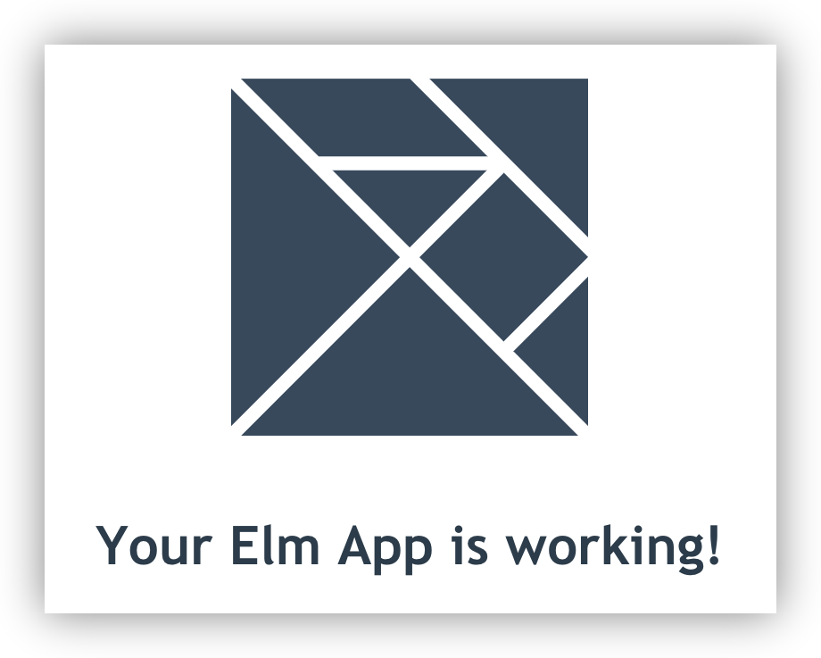
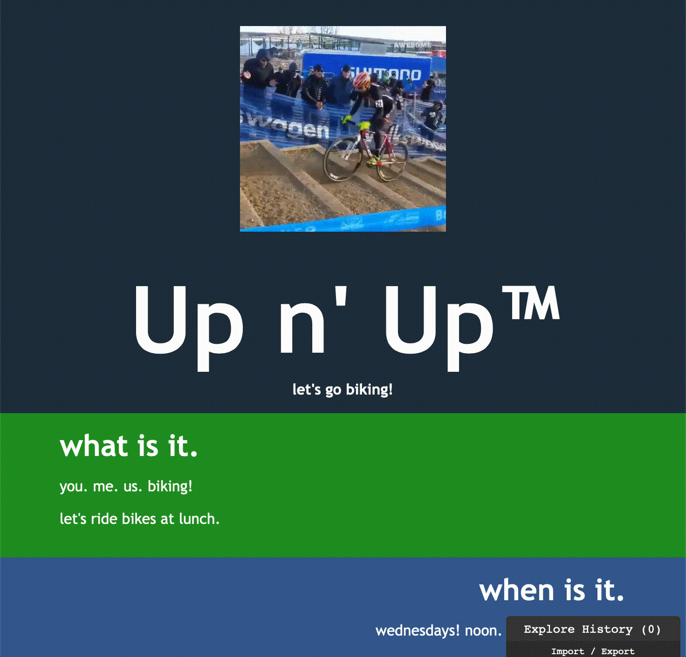
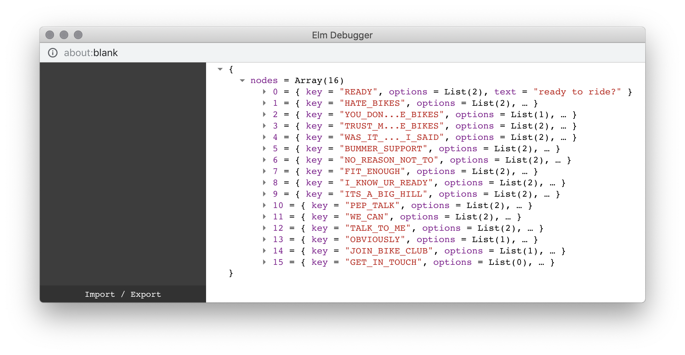
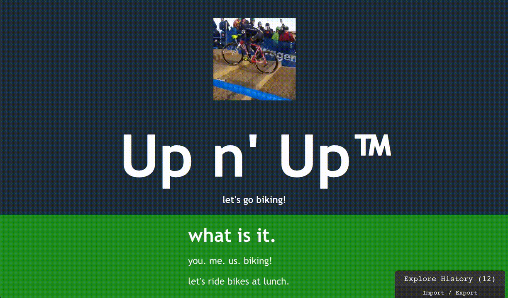

## in the beginning...

there was a browser, and it was good.

there were also machines, science, and the lamba calculus. they were also good.

together, they inspired [elm lang](https://elm-lang.org/). it _is_ good.

elm is for making browser applications. it has a
[_great_ guide](https://guide.elm-lang.org/), too. although the guide is
thorough, it is unabashedly terse, much like elm itself. i would argue that the
elm guide's conciseness is a feature™. however, when it comes down to actually
writing code, those of us who have forgetten our
[functional roots](https://plt-scheme.org/), or those of us who were never
introduced, have a hard time knowing how to model our programs.

so, let's write some code. below we will make a small app, from scratch, with
milestones on github for those who want to code along. forewarning, this will
_not_ cover many of the topics in the guide. i _will_ try and drop helpful
breadcrumbs into the guide as we progress.

## baby's first steps

let's make an app about bikes. 🚲

the purpose of this website will be to convince everyone to go biking with me,
and give them an interactive scroll experience as they click around an in-app
survey.

first, install [node](https://nodejs.org/en/) &
[elm](https://guide.elm-lang.org/install.html).

next, run:

```bash
$ npx create-elm-app up-and-up && \
  cd up-and-up && \
  elm-app start
...
You can now view up-and-up in the browser.

  Local:            http://localhost:3000/
  On Your Network:  http://10.228.59.249:3000/
```

sweet. our first app. let's take a peek in the browser:



[git milestone 1](https://github.com/cdaringe/up-and-up/tree/ac14ed6ee6a3a6e923d5e3817680485e94a41800)

there's really not much to see yet. i removed a bit of cruft from the default
boilerplate in
[git milestone 2](https://github.com/cdaringe/up-and-up/tree/cf3c886f8eb9f5e54c1af45c30f320c109c8abac),
which is where we _actually_ begin.

## bootstrap the app

like so many languages, your elm program begins with a `main` function. it's
just like old times!

```elm
main =
    Browser.element
        { view = view
        , init = \_ -> init
        , update = update
        , subscriptions = always Sub.none
        }
```

the
[Browser.element](https://package.elm-lang.org/packages/elm/browser/latest/Browser#element)
function is _critical_ to our app. it takes a record and wires up _other
functions_ that tell our app:

1. what to render (`view`),
2. what state to start with (`init`),
3. how to react to events/side-effects (`update`), and
4. how to listen to side-effects (`subscriptions`)

familiar with react & redux? here's what these fields loosely conceptually map
into:

```elm
{ view = view -- a functional stateless component, at the root of your app
, init = \_ -> init -- getInitialState()
, update = update -- rootReducer
, subscriptions = always Sub.none -- redux-observable, redux-saga
}
```

not so bad right? the full signature is actually:

```elm
main : Program () Model Msg
main = Browser.element { ... }
```

the signature of main takes no args and returns a... `Program () Model Msg`? if
you are thinking "WTF is a `Program () Model Msg`", don't worry about
it--seriously. it will come naturally later.

## let's make some DOM!

we just saw the `view` function used above. very soon, we will want to add some
bicycling content to the page. before we do, let's break down the current view
function. we began with:

```elm
view : Model -> Html Msg
view model =
    div []
        [ img [ src "/logo.svg" ] []
        , h1 [] [ text "Your Elm App is working!" ]
        ]
```

looking at the first line, we see that `view` is a _function_ that takes as
input a `Model` instance and produces a `Html Msg`.

next, let's break the body down bit by bit:

```elm
view model = ...
-- fn_name arg = <body>
```

```elm
-- div is a fn from the `Html` package with the signature:
-- fn_name (List Html.Attribute) (List (Html Msg))
-- which outputs a Html Msg
div [] [...]
```

```elm
-- children of the div
-- img, h1, & text are functions from `Html` module
...
  [ img [ src "/logo.svg" ] [] -- src is a function from the `Html.Attributes` module
  , h1 [] [ text "Your Elm App is working!" ]
  ]
```

in the end, `view` is a just function that creates a `Html Cmd` instance. for
now, you can think of this as just `Html` and ignore the `Cmd` part if you are
unfamiliar. these `Html` instances will eventually flush out to DOM nodes, if
you hadn't already guessed. `view` calls a bunch of other functions internally
as well with `List`s of attributes and `List`s of children, where each of those
also produce `Html`. if you've done any react development, you may notice how
similar this signature is to `React.createClass(type, props, children)`.

let's get a bike image on screen, and some info about the bike club.

```elm
view model =
    div []
      [ header []
          [ img [ src "/bike.gif"] []
          , h1 [] [ text "Up n' Up™" ]
          , h4 [] [ text "let's go biking!" ]
          ]
      , div [ class "wut info" ]
          [ h1 [] [ text "what is it." ]
          , p [] [ text "you. me. us.  biking!" ]
          , p [] [ text "let's ride bikes at lunch." ]
          ]
      , div [ class "when info" ]
          [ h1 [] [ text "when is it." ]
          , p [] [ text "wednesdays! noon. fair weather only." ]
          ]
      ]
```

let's add some image and css assets, and see what we get:



"we didn't need elm to do that" you may be saying. we sure didn't, but isn't it
beautiful? who wants to write a loosey-goosey DSL (HTML) over strongly typed,
terse functions instead?
[git milestone 3](https://github.com/cdaringe/up-and-up/tree/75fd4974d9b87306442ee69d3558a63d5640e022)

## loadin datas

as discussed earlier, i want to make the page interactive for my viewers. the
goal is to ask the user a question, and provide a fixed set of responses for
them to respond to. upon clicking a response, the user will be scrolled to the
next question, and so on, until finally they end up agreeing to go biking. we
will make a data structure to represent this basic graph traversal exercise.
it's worth noting that our question set _will have cycles_ in it. we want to
trick the user into thinking that he or she still has free will in this
decision. bikes or bust!

here's a snapshot of the question graph:

```json
[
  {
    "key": "READY",
    "text": "ready to ride?",
    "options": [
      { "text": "i'm in!", "to": "JOIN_BIKE_CLUB" },
      { "text": "no. i'm not interested.", "to": "HATE_BIKES" }
    ]
  },
  {
    "key": "HATE_BIKES",
    "text": "what--do you hate bikes?",
    "options": [
      { "text": "ya.  i hate 'em real bad", "to": "YOU_DONT_HATE_BIKES" },
      { "text": "no.", "to": "WAS_IT_SOMETHING_I_SAID" }
    ]
  },
  ...
  {
    "key": "JOIN_BIKE_CLUB",
    "text": "nice! let's ride!",
    "options": [
      { "text": "what's next?", "to": "GET_IN_TOUCH" }
    ]
  },
  ...
}
```

i'll create a new elm module to define types to marshall these values into:

```elm
-- Node.elm
module Node exposing (Edge, Node)

import List


type alias Edge =
    { text : String
    , to : String
    }


type alias Node =
    { key : String
    , text : String
    , options : List Edge
    }
```

now, how do we _actually_ load our data into Elm? because the json is static, we
can use elm's `flags` feature to provide this data on `init`. but before we get
to using flags to load to data into elm, we need to figure out how to load the
asset into the browser at all.

each elm application's true entrypoint is _actually_ a js file. in this
application we are using `create-elm-app`, which uses
[webpack](https://webpack.js.org) to bundle and load assets, available to us for
free. in this context, we can simply `import <json-file>`, and pass that file
directly into elm.

```js
import "./main.css";
import { Elm } from "./Main.elm";
import nodes from "./nodes.json";

Elm.Main.init({
  node: document.getElementById("root"),
  flags: {
    // `nodes` is parsed into a javascript object by webpack's
    // json-loader.  it is _not_ a JSON string
    nodes,
  },
});
```

neat. now that our data is available and being passed, we actually need to do
something with it, elm side.

first off, we need to define types for flags. it needs to have the exact same
shape as what is passed to `Elm.Main.init({ flags: FLAGS })`:

```elm
type alias Flags =
    { nodes : Array Node -- `List Node` would work, too
    }
```

when we get the `flags` data, what will we do with it? the elm architecture has
a recipe for this. we need to update our `Model` to capture and persist the
inbound data:

```elm
type alias Model =
    { nodes : Array Node
    }
```

as discussed earlier, the `init` function is responsible for mapping flags to
our initial state. let's update the default init function:

```elm
init : Flags -> ( Model, Cmd Msg )
init flags =
    ( { nodes = flags.nodes
      }
    , Cmd.none
    )
```

finally, let's update our `main` to reflect this new workflow:

```elm
main : Program Flags Model Msg -- `Flags` was previously `()`
main =
    Browser.element
        { view = view
        , init = \flags -> init flags
        , update = update
        , subscriptions = always Sub.none
        }
```

not too bad, right? it feels like a bit much at first, but we did a bit of extra
legwork to make sure that the js -> elm interop went swimmingly. a takeaway that
is not immediately apparent in the above code is that when flags are passed,
**they are typechecked at runtime** as they are coerced into elm types!

at this point, in our app we can see that our model has been successfully
updated via the elm debugger:



see
[git milestone 4](https://github.com/cdaringe/up-and-up/tree/8b83af753d495129e96e599af2c57bde215fb881).

## render the nodes

model acquired! let's render the nodes onto the page:

```elm
-- refactor our introductory content into its own function
render_intro =
    [ header []
        [ img [ src "/bike.gif" ] []
        , h1 [] [ text "Up n' Up™" ]
        , h4 [] [ text "let's go biking!" ]
        ]
    , ... -- truncated for brevity
    ]


render_node node =
    let
        { options, text } =
            node
    in
    div [ class "node__container" ]
        [ div
            [ class "node__content" ]
          <|
            concat
                [ [ h1 [] [ Html.text text ] ]
                , map
                    (\link ->
                        div []
                            [ button [ onClick NoOp ] [ Html.text link.text ]
                            ]
                    )
                    options
                ]
        ]


render_nodes nodes =
    let
        fragments =
            Array.map render_node nodes
    in
        Array.toList fragments

view model =
    div [] <|
        concat
            [ render_intro
            , render_nodes model.nodes
            ]
```

what a simple view! the primary view function renders two main segments: the
introduction section and the nodes section. `render_nodes` calls `render_node`
for each `node`. it's rather boring. with a little css spritzed in, we have a
crude rendering implementation in place. see see
[git milestone 5](https://github.com/cdaringe/up-and-up/tree/e584c1233ad94281bf088f607652d3f3c00621b3).


forgive the fact that nothing is particularly _pretty_ by this point. let's
instead take a peek at that `NoOp` used above.

## get interactive

when we click a button, it should navigate the edge to the associated node. but
all we have is a `NoOp`! let's swap it with a `ScrollToPane String`.

```elm
type Msg
  = NoOp
  | ScrollToPane String -- new Msg type!


scrollToPane id = -- new function! returns a Cmd msg
    Dom.getElement id
        |> Task.andThen (\el -> Dom.setViewport el.element.x el.element.y)
        |> Task.onError (\_ -> Task.succeed ()) -- hack. swallow DOM errors for now
        |> Task.perform (\_ -> NoOp)


update : Msg -> Model -> ( Model, Cmd Msg )
update msg model =
    case msg of
        NoOp ->
            ( model, Cmd.none )

        ScrollToPane id -> -- new case!
            -- upon request, kick off the managed scroll side effect
            ( model, scrollToPane id )

...

render_node node =
    ...
    -- new attribute! we're adding an id now to each node root
    div [ id key, class "node__container" ]
       ... -- and let's swap that `NoOp` with a `Msg` of `ScrollToPane String`
       (\link ->
          [ button [ onClick <| ScrollToPane link.to ] ...
```

now the buttons actually work!

1. `onClick`, we emit a `ScrollToPane String` message.
   1. remember, the `view` function produces a `Html Msg`--Html that can emit
      messages! `Browser.element` wires those messages to our update handler.
2. the `update` function handles the message and triggers elm to go off and work
   on the command generated by `scrollToPane`.
3. `scrollToPane` queries the element id we passed in our message above and
   scrolls to it.
4. we `NoOp` post-scroll. clicking a navigation option only generates
   _side-effect_.

no sweat.
[git milestone 6](https://github.com/cdaringe/up-and-up/tree/beb4f8435be676bbf77a60afae706e4d87b922c4)
complete.



## conclusion

there's so much more to do and cover! in fact, in my
[alternate implementation](https://upnup.cdaringe.com/)
([src](https://github.com/cdaringe/up-n-up)), i dig into using elm
[ports](https://guide.elm-lang.org/interop/ports.html) and [subscriptions](),
which are actually fairly straightforward js to elm pubsub mechanisms. i also do
a bit more styling.

regardless, let's summarize. we successfully:

1. created an elm app using create-elm-app
2. studied the elm bootstrap sequeunce (`Elm.Main.init` -> `main`)
3. understood how elm uses pure functions to create Html/Dom nodes
4. learned how attributes and children can be wired in, using additional
   functions from the `Html[.*]` modules
5. grazed over the elm architecture, which we drew direct parallels to
   react/redux
6. updated our applications state model and messages
7. bound our view layer to a click handler that generated messages that could be
   reduces
8. fired off a managed side-effect for scrolling the browser, and got a first
   taste of elm `Task`s, which are akin to lazy promises.

questions? edits? send them my way
[here](https://github.com/cdaringe/blog/issues).
