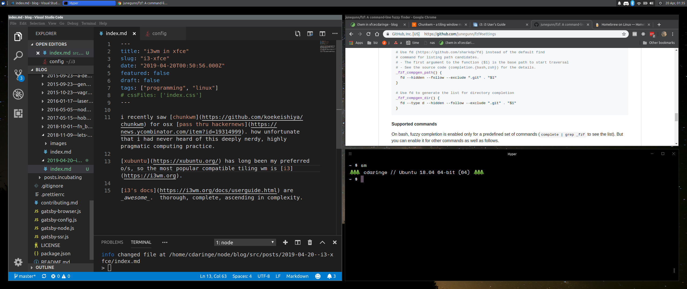

## discovery

i recently saw [chunk](https://github.com/koekeishiya/chunkwm) [tiling wm](https://en.wikipedia.org/wiki/Tiling_window_manager) for osx [pass thru hackernews](https://news.ycombinator.com/item?id=19314999). how unfortunate that i had never heard of this type of deeply nerdy, highly pragmatic tool.

[xubuntu](https://xubuntu.org/) has long been my preferred o/s, so i did some research and found that the most popular compatible tiling wm appeared to be [i3](https://i3wm.org).

[i3's docs](https://i3wm.org/docs/userguide.html) are _awesome_.  thorough, complete, and in ascending in complexity. i was eager to try.

## setup

i executed the following steps:

- followed [feeble nerd's guide](http://feeblenerd.blogspot.com/2015/11/pretty-i3-with-xfce.html) to installing `i3` on xfce
    - the guide is old, but still highly accurate
- added `i3-gaps` [[1](https://github.com/Airblader/i3),[2](https://github.com/pasiegel/i3-gaps-install-ubuntu)]
    - i had to compile this from source, which was no issue.  there are no prebuilt debian packages for gaps ready to roll in any ubuntu/debian ppa's
    - the wiki also has a default configuration, but it's missing default values for inner & outer gaps between windows
- disabled the `colemak` keymapping variant
    - there is a keymapping option to just make the things work if you're a colemak user.  _dont use it_--it only sorta kinda partially works.  reconfigure your mappings one-by-one, or, use keycodes like the docs suggest!

 
 

that was all! the formal i3 documentation is a must read for users as well.  you can see my [config here](./https://github.com/cdaringe/dotfiles/blob/master/env/.i3/config).

## observations

- the tiling aspect of the wm is surprisingly easy to use
- the tiling aspect of the wm is surprisingly fun to use
- tuning xfce to integrate well with i3 wasn't difficult, but involves a non-trivial amount tweaks and complexity
    - in retrospect, this is likely the case anytime one swaps the wm on a system

now that i understand why tiling-wm fanboys are such admirers of tiling, i'm eager to adopt chunk on my work osx machine. i don't often recommend complicated system changes to people if they are comfortable with their workflow, but this was worth it, and i _do_ recommend trying it. i look forward to greater productivity and organization by committing myself to this tooling.
