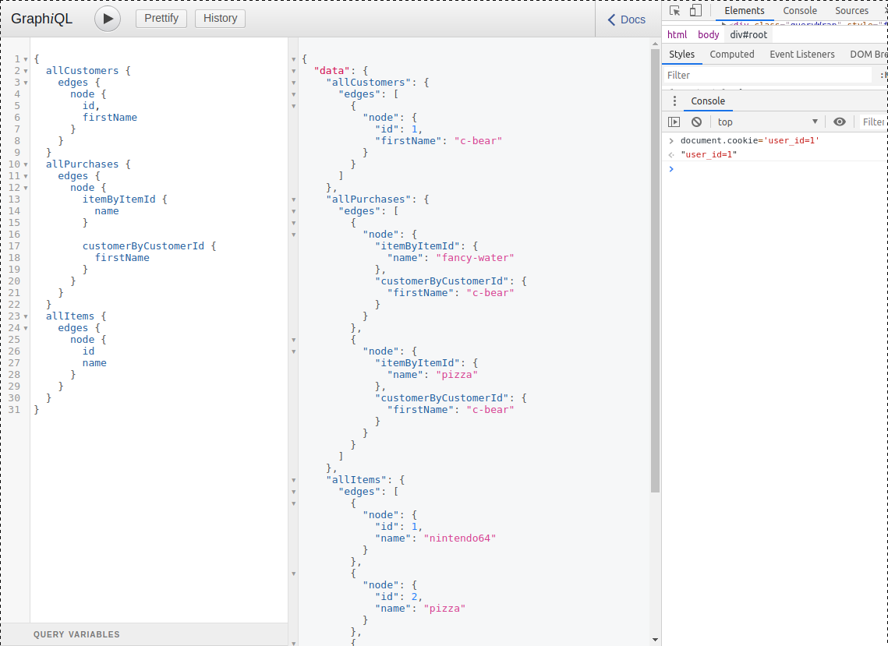
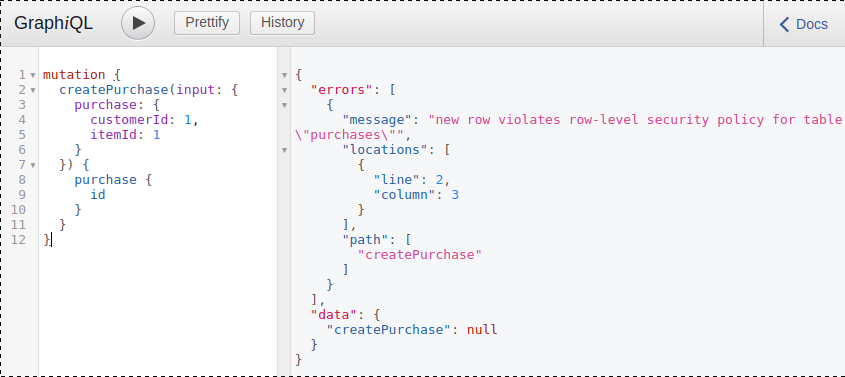

<div style='display: block;width:100%;text-align: center;'><div style='margin: auto; width: 300px'></div></div>
<small style='display: block;width:100%;text-align: center;'>bacon. though delicious, completely irrelevant to this post.</small>
<br />

securing web applications is hard. developers must consider a diverse set of
risks when delivering systems that handle sensitive data. a cursory glance over
the
[owasp top 10](https://www.owasp.org/images/7/72/OWASP_Top_10-2017_%28en%29.pdf.pdf)
reveals that securing a system is not a matter of "installing this" or "turning
this feature on." rather, securing an application involves auditing and
evaluating design patterns, which is often difficult due to lack of process
formalities. row-level security (rls) is just one design pattern that can
improve part of an application's data-security story. we'll explore how.

## it's easy to fail at security.

really easy.

we haven't made our technical lives much easier on some of these fronts. let's
focus on just _one_ of the OWASP risks, broken access control. two of the many
possible side-effects of bad access control is exposure of data and undesired
mutation of data. historically, software engineering teams have:

- protected against these risks at the application level, not at the data level
- tested data security manually, not via automation

bummer. so what does bad access control look like in practice? here are some
potential snippets:

```python
router.route("/api/person?fields=birthday", handler)
# ^ whoops, can anyone query everyone's birthday?
# what about authentication?

@authenticated(roles="member")
router.route("/api/person?fields=birthday", handler)
# ^ whoops, this may limit who can access the
# data to memebers only, but did enforcing
# authentication fix the risk of over-exposure?
# what about authorization?

# handler.py - option 1
def handler():
  return psycopg.query("select birthday from persons")
  # ^ whoops, we're still exposing everyone's
  # birthday, even if the user is an authenticated
  # member. authorization needs a where clause
```

in just a few lines of code, we saw a variety of naive places were developers
may have easily over exposed data. it's worth noting that there are--more
commonly than not--layers in our applications, large call stacks separating our
entrypoints from our data resolvers. this gap often makes validation of the
resultant queries difficult. the `@authenticated` decorator could feasibly give
a false positive to junior developers, implying that this data flow is "secure",
when--as discussed before--there is much more to securing a service than meets
the eye.

this example is purely hypothetical, and more simple than compelling for what
comes next. make no mistake though, as it appears that these types of
[security leaks are rampant](https://www.researchgate.net/publication/328956656_Quantitative_Assessment_on_Broken_Access_Control_Vulnerability_in_Web_Applications)
on the open web. we found a simiar leak at the office last month from a team of
expert and respected engineers.

broken access control is challenging and real.

## rls to the rescue

rls let's you protect your data records _within_ the db. until recently,
database access models did not support access constraints at the record level.
access constraints were generally available on higher level primitives. this
means that you could set RBAC roles for a query, but if a user was querying say
the `persons` tables, she'd have access to _all persons_, which is problematic
as demonstrated in our above snippets.

"so is row-level security is going to save the day?"

yup, pretty much. what i'm hear to say is that rls is a _really good idea_, and
you ought at least consider it at design time if you own a data layer.

if i can get you to
[click this postgres rls link](https://www.postgresql.org/docs/current/ddl-rowsecurity.html)
and expose you to the concept, that alone is a big win.

## rls in practice

let's walk through an example. you can also complete this exercise whilst
following along with the
[super-commerce](https://github.com/cdaringe/super-commerce) codebase. feel free
to clone it down, execute it, and tinker as we read through it below.

here's the plan. we will:

1. create tables to hold application data, using
   [postresql](https://www.postgresql.org)
1. protect the sensitive data using rls
1. create some seed data and load everything into a database
1. test that rls is working per expectation and reflect on our design
1. write a tiny application that integrates with the db just for kicks

### create tables

our app will have customers that can make purchases of items from a store.

```sql
create table items (
  id serial unique,
  name varchar
);
create table customers (
  id serial unique,
  first_name varchar
);
create table purchases (
  id serial,
  item_id int  not null references items (id),
  customer_id int  not null references customers (id)
);
```

```
postgres=# \d purchases
                               Table "public.purchases"
   Column    |  Type   | Collation | Nullable |                Default
-------------+---------+-----------+----------+---------------------------------------
 id          | integer |           | not null | nextval('purchases_id_seq'::regclass)
 item_id     | integer |           | not null |
 customer_id | integer |           | not null |
Foreign-key constraints:
    "purchases_customer_id_fkey" FOREIGN KEY (customer_id) REFERENCES customers(id)
    "purchases_item_id_fkey" FOREIGN KEY (item_id) REFERENCES items(id)
```

all looks correct!

### protect sensitive data

it's ok for anyone to query all of the `items` in the database. the more they
see the better! our store wants people to be able to buy everything! however,

- a customer should only be able to view her customer data, but no one elses'
  customer records
- a customer should only be able to view his purchases, but no one elses'
  purchase records

thus, let us apply rls on those two tables:

```sql
-- we 1st need a non-super-user role for our app
create user commerce;

-- the following statements are the core of what
-- we need to have rock solid, high perf rls!
alter table customers enable row level security;
alter table purchases enable row level security;

create policy customers_crud on customers
	using (id = get_commerce_user_id());
  -- allow the customer to read and update her record.
  -- in our demo, the commerce_user_id is passed into
  -- the query context via postgres config.
  -- more on that later!

create policy purchases_crud on purchases
	using (customer_id = get_commerce_user_id() or is_admin())
	with check (is_admin());
  -- allow the customer to read his purchase records,
  -- but only allow an admins to edit/create records.
  -- @warn - `is_admin` is in the using clause as well because
  -- `insert ... returns` sql statements get checked
  -- with `with check` _and_ `using` conditions!
```

in a nutshell, one must:

- enable rls for a table
- create a policy with conditionals, dictating if a record is included in the
  query set
  - for `select` query inclusion, the `using(...)` conditional must yield `true`
  - for `update/insert` permissions, the `with check(...)` conditional must
    yield `true`

in truth, rls policies aren't quite as simple as that, but that's 80% of what
you need to know!

you may have noticed that my conditionals referenced a couple of `pgplsql`
functions. the two functions, `is_admin()` and `get_commerce_user_id()`, may be
viewed in the appendix at the end of the post. omitted for brevity.

```sql
-- finally make sure our user can access our tables/fns/etc.
-- this is standard database bootstrapping stuff.
grant all on all tables in schema public to commerce;
grant all on all sequences in schema public to commerce;
grant execute on all functions in schema public to commerce;
revoke update (id) on table customers from public;
revoke update (id) on table items from public;
revoke update (id) on table purchases from public;
```

### seed the database

```sql
insert into items (name) values
  ('nintendo64'),
  ('pizza'),
  ('cacao-nibs'),
  ('fancy-water');

insert into customers (first_name) values
  ('c-bear'),
  ('jamal'),
  ('jessica'),
  ('chaz');

insert into purchases (customer_id, item_id) values
  (1, 4),
  (1, 2), -- now that's a meal, c-bear! pizza & la croix. #hipster
  (2, 1), -- mario 64, great game. enjoy, jamal!
  (3, 3), -- tasty nibs for jessica
  (4, 3); -- tasty nibs for chaz
```


<small style='display: block;width:100%;text-align: center;'>[c-bear](https://en.wikipedia.org/wiki/C_Bear_and_Jamal),
great guy</small>

### test it out & reflect on our design

now that we have data loaded in, let's test if rls is _really_ protecting our
datas. let's log into the database with our non-super role:

```
$ psql --host localhost -p 5432 --username=commerce postgres
```

now, let's try and access all of the records in each table:

```
postgres=> select * from customers;
 id | first_name
----+------------
(0 rows)

postgres=> select * from purchases;
 id | item_id | customer_id
----+---------+-------------
(0 rows)

postgres=> select * from items;
 id |    name
----+-------------
  1 | nintendo64
  2 | pizza
  3 | cacao-nibs
  4 | fancy-water
(4 rows)
```

good! we see items, but because the transaction has no `user_id` set, the rls
protected `customers` & `purchases` queries yielded no resuts.

what if we set a `user_id` and run our queries again with the user `c-bear`
configured? i know `c-bear` has `id === 1` just by inference based on seed data
insert order. more commonly, a user id would be provided by an identity
provider, auth service, oauth thingy, jwt, or perhaps even provided by the same
database. for the purposes of demonstration, it doesn't matter where the
`user_id` comes from--it just matters that all parts of the application/system
have a common way to reference users.

```
postgres=> select set_config('commerce.user_id', '1', false);
 set_config
------------
 1
(1 row)

postgres=> select * from purchases;
 id | item_id | customer_id
----+---------+-------------
  1 |       4 |           1 -- c-bear's fancy-water
  2 |       2 |           1 -- c-bear's pizza
(2 rows)

postgres=> select * from customers;
 id | first_name
----+------------
  1 | c-bear
(1 row)
```

this is awesome! now we see records that belong just to `c-bear`.

to summarize, by default, we saw that our queries yielded no data. safety first!
once we specified the user as c-bear, we saw _only_ his data. we observed the
rls policies active in _all queries_. we saw no data leak through for jamal,
jessica, or chaz anywhere, anytime. what's also great about this approach is
that we don't have to write carefully crafted sql to get specific user datas. i
just wrote a basic `select * from <table>` and i got a reduced, user-centric
set. we probably _should_ write it for performance reasons (e.g. wire in
effective `where` clauses), but we don't _need_ to.

now, how do i feel about the design?

**this access model is robust**. application code simply needs to provide a user
and the db handles the rest. there's no _risky_ application control flows
dictating resultant data sets--just flat conditionals at the record level. i
concede that _it is feasible_ to mess up configuring rls policies to begin with.
i argue, however, that if culturally a team sets a precedence that data is
secured at the database level, it's intuitive for engineers to see & expect
policies in migrations and in table defintions. further, policies intrinsically
tend to be much more robust than application code. policies are often
type-checked, cross-referenced against database columns at migration time, and
have very little logic. thus, engineers have _some_ positive data points
suggesting robustness is achieved.

**auditing table policies is also much easier than auditing application code for
security patterns**. policies may be reviewed by simply scanning a table+policy
list. auditing application code takes creativity and control flow
traversals--sounds hard!

### let's make an app!

we did a bunch of great work in the database. does it pay dividends in
application code? you know it does!

here's the plan. we will:

1. make a commerce server application that consumes our database. i used
   [typescript](https://www.typescriptlang.org) &
   [nodejs](https://nodejs.org/en/) for this.
1. use [koa](https://koajs.com/) to bootstrap the server and handle requests
1. use [postgraphile](https://www.graphile.org/postgraphile/) server middleware
   to connect our server to the database, and reflect back a graphql api
   1. postgraphile will add `/graphql` and `/graphiql` routes to the app
      1. now we have many queries (i.e. `select`s) and mutations (i.e.
         `insert/update`s) ready to roll from the server
   1. we will wire in a feature called `pgSettings`, which ultimately calls
      postgres' `set_config(...)` function for all of our rls key-values for
      _each_ query!
1. start the server and play around

the app is so small, here's the whole thing:

```ts
import Koa from "koa";
import { postgraphile as createPostgaphileMiddleware } from "postgraphile";
import { IncomingMessage } from "http";

const log = (...args: any[]) => console.log("[super-commerce]", ...args);

async function start() {
  const app = new Koa();
  app.use(
    createPostgaphileMiddleware(
      "postgres://commerce@localhost:5432/postgres",
      "public",
      {
        graphiql: true,
        pgSettings: async (req) => {
          const { userId, isAdmin } = await getUser(req);
          return {
            "commerce.is_admin": isAdmin,
            "commerce.user_id": userId,
          };
        },
      }
    )
  );
  app.listen(3000);
  log("server listening on 3000");
  log("visit http://localhost:3000/graphiql to play");
}

const getUser = async (req: IncomingMessage) => {
  // in a real app, you'd probably have an auth middleware,
  // which may do something like:
  // const userId = await authClient.decodeAndValidatedUser({
  //   jwt: req.headers.jwt
  // })

  // @warning - *never actually do this!*
  // for simplicty sake--let's pretend that the
  // authorized user_id is in the cookie.
  // 1 c-bear, 2 jamal, 3 jessica, 4 chaz
  const cookie = req.headers.cookie || "";
  const userId = cookie.match(/user_id=(\d+)/i)
    ? parseInt(cookie.match(/user_id=(\d+)/i)![1], 10)
    : 0;
  return {
    isAdmin: !!cookie.match(/is_admin/i),
    userId,
  };
};
start();
```

50 LOC, not so bad! when the server runs, it also exposes a
[graphiql](https://github.com/graphql/graphiql) instance, so we can play with
our data!



let's play around.

#### prove each customer can only see his stuff

- open [http://localhost:3000/graphiql](http://localhost:3000/graphiql)
- in the browser dev console, set `document.cookie='user_id=1'` to fake
  authorize as c-bear
- execute the following query:

```graphql
{
  allCustomers {
    edges {
      node {
        id
        firstName
      }
    }
  }
  allPurchases {
    edges {
      node {
        itemByItemId {
          name
        }
        customerByCustomerId {
          firstName
        }
      }
    }
  }
  allItems {
    edges {
      node {
        id
        name
      }
    }
  }
}
```

as shown in the query results & screenshot above, it's clear that c-bear can
_only see_ his purchased pizza and fancy-water from the store.

how about trying as a different user?

- set the `user_id` cookie `=2`, which corresponds to jamal
- rerun the query, and observe that jamal can see his nintendo64 purchase and
  nothing else

#### prove that only admins can add purchases

in a real commerce setting, only the commerce point of sale (pos) should log a
transaction. a user otherwise could log a transaction without actually paying,
initiate a return, and thus steal money! let's declare that the pos system is an
`admin` user. in practice, the pos system would probably have a reduced role.

- open [http://localhost:3000/graphiql](http://localhost:3000/graphiql)
- in the browser dev console, set `document.cookie=''` to reset us to a clean
  state
- execute the following query:

```graphql
mutation {
  createPurchase(input: { purchase: { customerId: 1, itemId: 1 } }) {
    purchase {
      id
    }
  }
}
```

we expect this to fail due to a rls violation. to add a purchase, we needed to
be an admin. sure enough, the query shows a "new row violates row-level security
policy" error message:



- set `document.cookie='is_admin=1'`
- run the query again, and see that it succeeds with:

```json
{
  "data": {
    "createPurchase": {
      "purchase": {
        "id": 6
      }
    }
  }
}
```

### assessing our app's access control

**very little access control is present in our app**, and that's a feature. we
need to make an authc/authz call to validate our user, get her id & roles (e.g.
`is_admin`), and pump that result directly into our db calls. this is the only
flow where falible human programmers can mess up our in-database security,
perhaps by passing the wrong user. such a failure is unlikely, and likely easy
to rectify if a bug were to ever sprout.

## summary

- security is hard, and it's easy to mess up access controls
- rls can help improve access control, right next to your data at rest
- rls is easy to implement, assuming your db provider supports it
- a compact demo of rls in action with an attached application can be download
  and run from [super-commerce](https://github.com/cdaringe/super-commerce)
- some rbac concerns disappears from your application when using rls, shaving
  off complexity and trimming lines-of-code

try it out!

## appendix

### postgres auth functions

```sql
create or replace function is_admin() returns bool as $$
	begin
		if current_setting('commerce.is_admin', true) = 'true' then
			return true;
		end if;
		return false;
	end;
$$ language plpgsql stable security definer;

create function get_commerce_user_id() returns int as $$
	declare
		user_id_str varchar;
	begin
		user_id_str := current_setting('commerce.user_id', true);
		if user_id_str is null or user_id_str = '' then
			return 0; -- postgres serial ids start at 1
		end if;
		return user_id_str::int;
	end;
$$ language plpgsql stable security definer;
```
