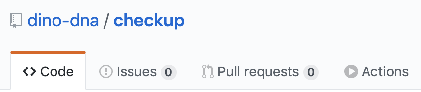
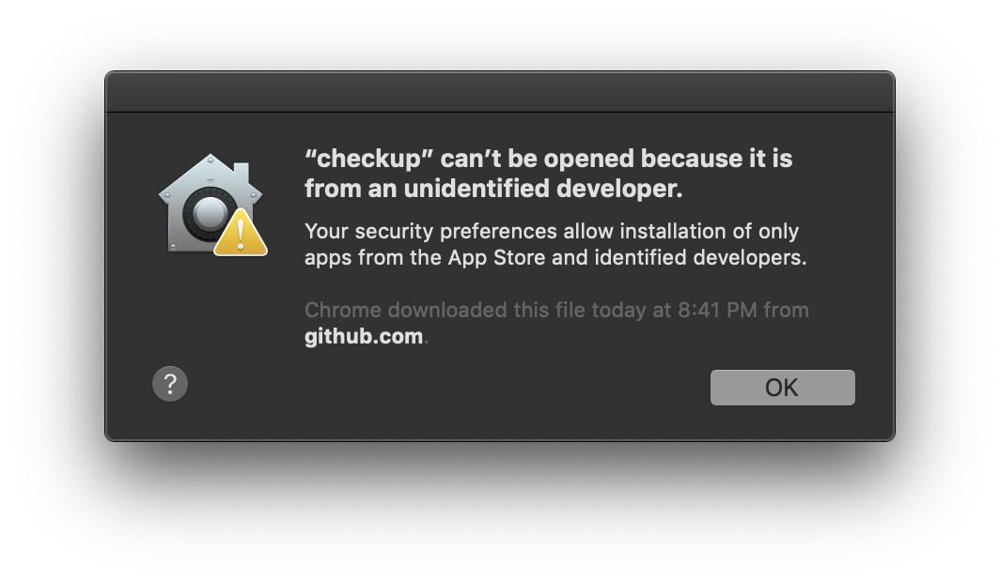
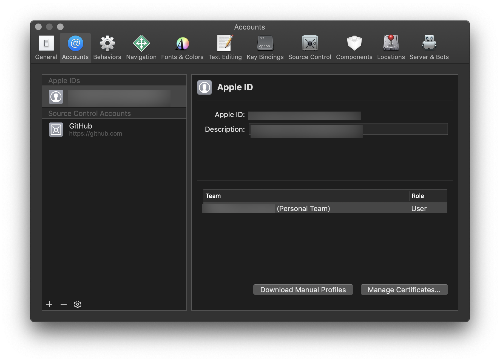
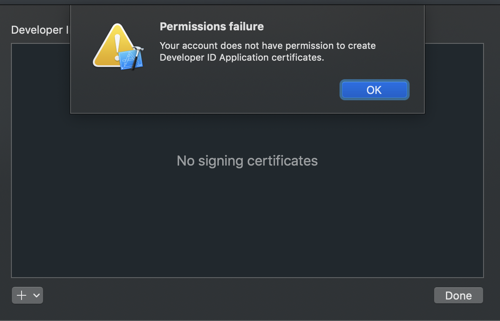
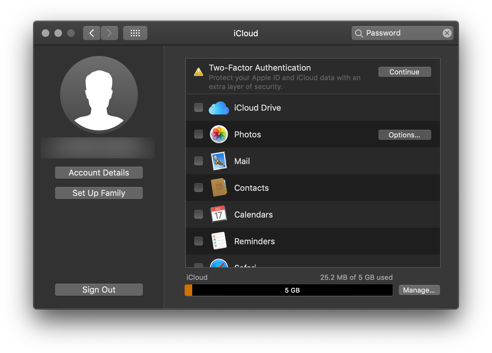
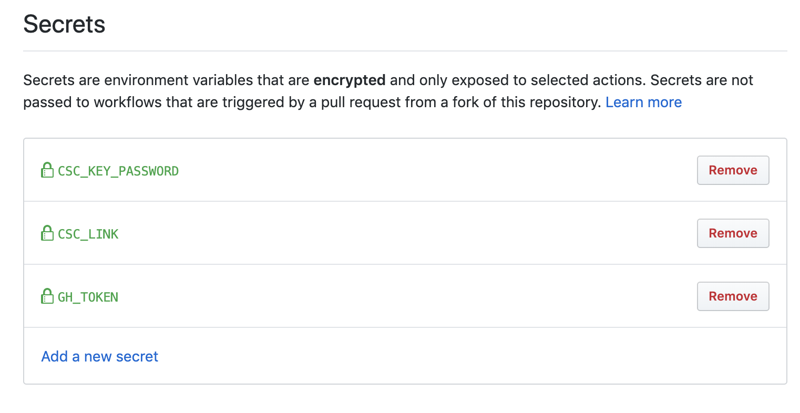
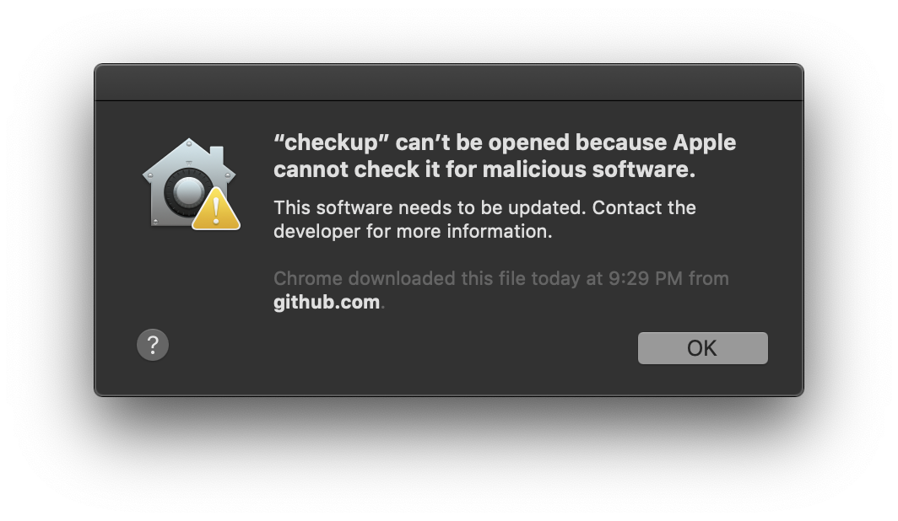
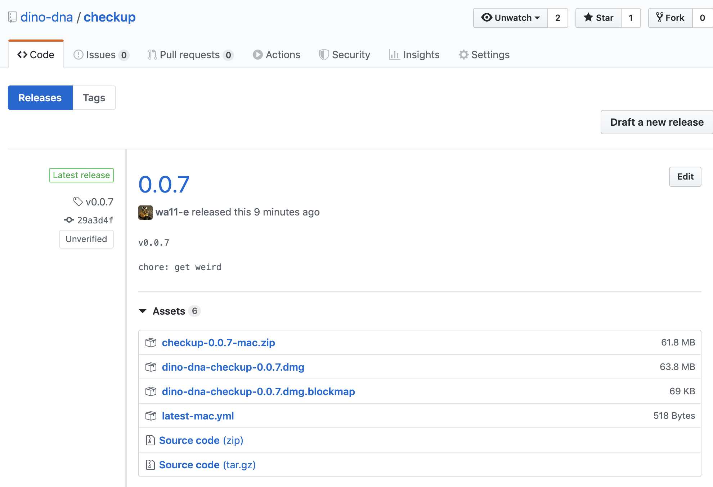

You've developed an electron application.  Congratulations, you've done the easy part.  Now it's time to build, sign, and ship it.  If you want people to visit your GitHub releases and simply download a copy of your application and launch it, this article is for you.

It is assumed that you are using [electron-builder](https://github.com/electron-userland/electron-builder) to build & ship your electron distributions.

## what we'll cover

- building with github actions as a ci provider
- building & signing _just_ for osx
- publishing releases to github releases

The code snippets shared are incrimental.  See the source code for the example project at [dino-dna/checkup](https://github.com/dino-dna/checkup) for final artifacts!

## setting up ci

- signup for [github actions](https://github.com/features/actions)
- create a `.github/workflows/workflow.yml` file

```yml
name: ci
on:
  push:
    branches:
      - master
jobs:
  build_on_mac:
    runs-on: macOS-latest
    steps:
    - uses: actions/checkout@master
    - uses: actions/setup-node@master
      with:
        node-version: 12.8.0
    - name: install
      run: yarn
    - name: build # tsc, for a typescript project
      run: yarn build
    - name: test
      run: yarn test # ava, jest, whatever
    - name: release
      env:
        GH_TOKEN: ${{ secrets.GH_TOKEN }}
      # ^ GITHUB_TOKEN is auto created by actions, but a bug was making github
      # actions use the _masked_ token as the token value in then env var.
      # to mitigate, i created a new github token called GH_TOKEN, &
      # loaded it into github > settings > secrets. electron-builder wants a
      # token name GH_TOKEN anyway :)
      run: yarn release # electron-builder --publish always

  build_on_win:
    runs-on: windows-2016
    steps:
    # ... same as above -- copy steps down :)
```

now, an actions link should show up in your github repository's tabs:



## configuring signing

You likely want applications to be installable on mac without security warnings.  Seen messages like this installing some applications?



Signing with a mac [Developer ID](https://developer.apple.com/developer-id/) certificate is the first step to alleviating this problem.

To get started, you need to have an Apple ID setup in xcode:



Click manage certificates > + create certificate > Apple Developer ID



Have [this warning](https://stackoverflow.com/questions/55732294/your-account-does-not-have-permission-to-create-developer-id-application-certifi)?  Make sure you are [enrolled in the apple developer program](https://developer.apple.com/programs/).  It wouldn't let me enroll until I setup 2FA.  No problem, I had to sign into iCloud on osx to allow for this:



Now--**the worst part**--pay _$100_ for an account!  [Lame sauce](https://news.ycombinator.com/item?id=18260970).

Fine.  Buy the membership.  It took 15 mintues for my account to process and become active.  Once processed, you can add a `Developer ID` certificate, right click it, and export it.  Add a _strong_ password on export, but avoid special characters as we'll be using it in `bash` build env later.


Next up, follow the rest of [the electron-builder guide](https://www.electron.build/code-signing#travis-appveyor-and-other-ci-servers).  I demonstrate it here:

- `base64 -i my-exported-cert.p12 -o envValue.txt`
- `cat envValue.txt | pbcopy`, to add the file contents to your clipboard
- add the following secrets to your github repo:
  - `CSC_LINK` - the base64 value you just `pbcopy`'ed :)
  - `CSC_KEY_PASSWORD` - the password you used when exporting the cert
- expose the env vars in the github actions workflow

```yml
  ...
    - name: release
      env:
        CSC_KEY_PASSWORD: ${{ secrets.CSC_KEY_PASSWORD }}
        CSC_LINK: ${{ secrets.CSC_LINK }}
        GH_TOKEN: ${{ secrets.GH_TOKEN }}
```



Alright!  Let's kick off a build!  Inspecting the logs suggests all went well.  Download the .dmg, open it up, and...



Searching the web against this error led me to the following announcement:

> Starting with macOS 10.14.5, Apple is enforcing apps to be notarized for new developer IDs

<br />

Unpacking this new problem sent me down a deep rabbit hole.  Research uncovered that _I was not alone_, and by combining all of:

- https://github.com/electron-userland/electron-builder/issues/4040,
- https://developer.apple.com/documentation/xcode/notarizing_your_app_before_distribution,
- https://medium.com/@TwitterArchiveEraser/notarize-electron-apps-7a5f988406db, and most valuably:
- https://kilianvalkhof.com/2019/electron/notarizing-your-electron-application/

I was managed to add a notarization script into my build, and patch the electron builder configuration in my package.json to support it. Kilian's post above does _such an excellent job_ articulating the steps you need to take to be successful, I'll ask that you open and read his post, rather than have me copy and paste his great work here.

- patch your `package.json` as described
- add an `after-sign` `electron-builder` hook as described

Almost there.  You now need to embed two new secrets:

- `APPLE_ID` - your apple account ID (as referenced in the after-sign script)
- `APPLE_PASSWORD` - *not* your apple account password, but a _new_ password specific _to your application_, which should be labelled using the same value in your `package.build.appId` field. create an app password at [appleid.apple.com](https://appleid.apple.com)
  - ensure that your after-sign hook references the ENV variable names you select for these secrets

Now, your builds should be publishing to GitHub releases:



You should be able download your `.dmg`, install, and open without trouble!


Good luck!
