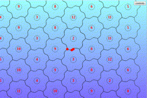

<div style='display: block; margin: auto; text-align: center; font-size: small;'><a href='https://cdaringe.github.io/tessl'>tessl</a>, a tessellation webapp</div>

[click here to launch demo web app](https://cdaringe.github.io/tessl). _warning_, it's not particularly mobile friendly.

# problem

No FOSS application exists to generate a series of hex-like tessellation tiles, where the output is exportable and guaranteed to _actually_ tessellate.

For those who aren't familiar with tessellations:

> a tessellation ... is a cover of the Euclidean plane by a countable number of closed sets, called tiles, such that the tiles intersect only on their boundaries.

<a style='margin-left: 8px; font-size: small;' href='https://en.wikipedia.org/wiki/Tessellation'>- https://en.wikipedia.org/wiki/Tessellation</a>

If that definition is too challenging to grok, you otherwise can think of a tessellation as shape that can be repeated and fit together with adjacent units without gaps between them!

# solution

Let's build such an app! The plan is as follows:

1. **create a path editor** - build a [SVG](https://developer.mozilla.org/en-US/docs/Web/SVG) `<path />` editor library for the web
2. **draw our base shape** - create a short `<path />` segment & enable real-time editing. replicate and transform the path various times to paint a hexagon.
3. **tessellate!** - group the paths in the hexagon into a logical hex-group, repeat the hex-group, and paint many tessellated instances

## create a path editor

The source code discussed in this section can be found on github at [cdaringe/d3-svg-path-editor](https://github.com/cdaringe/d3-svg-path-editor).

Why create a path editor? We want to create a regular tessellation of hexagon-_like_ shapes. Painting many simple hexagons is easy and doesn't require a path editor. However, with an editor we can create much more interesting and beautiful geometries that are certain to delight users.

To paint a tessellating hexagon-like shape, we need to make only one edge editable, and we can repeat that edge five more times.

What requirements do we want in a path editing experience? For this exercise, we will want the ability to:

- place nodes
- drag nodes
- provide points as input to paint a path, and get points as output from an edited path

<br />

Here's roughly what a path-editing user-experience could look like once rendered:

<br />


On to coding. Let's look at a proposal baseline interface:

```ts
const { path$ /* d3 path node */ } = fromPoints({
  points // [[0, 0], [10, 20]]
  svg$ // d3 svg node
})
```

We need to provide a SVG to paint a path into, so the `svg$` arg makes sense. We also want to paint a path _from points_ initially, as described above in our requirements. Unsurprisingly, we get a `path$` back. The `$` is a goofy little convention I still use from my jQuery days to annotate variables that hold values that wrap DOM nodes, such as `d3` or `jQuery` selections.

Let's walk the trimmed typescript source to understand the concepts of what's going on.

```ts
export const fromPoints = (opts: FromPoints) => {
  const { points, svg$ } = opts
  /**
   * wrap points into node containers, where we maintain additional
   * state about the point, such as d3 <circle /> selections
   * used whilst editing a path (you need something to drag on!)
   */
  const nodes = toMetaNodes(points)
  // add a <path /> node to the DOM
  const path$ =
    svg$
      .append('path')
      .attr('stroke', 'black')
      .attr('fill', 'none')

  // listen for mouse events, and when the user's mouse
  // nears the path, show where a proposed point could be added
  // to the path. allow a click event to promote a proposed
  // point into the proper set of points in the path!
  const snapper = createNodeSnapper({
    onAddNode: ({ length, point }) => { ... },
    svg$,
    path$
  })

  // go
  const render = () =>
    window.requestAnimationFrame(() =>
      // paint all of the nodes into the <path />.
      // onchange, re-render, but only when the thread has some
      // capacity, hence the requestAnimationFrame
      renderNodes({
        nodes,
        path$,
        render,
        svg$
      })
    )
  render()
  return {
    path$
  }
}
```

I can sense some eye rolling around the `toMetaNodes` call. What's a meta-node?
It's perhaps lazy naming on my part. Let's explore it a bit:

```ts
export type Point = [number, number];
export type MetaNode = {
  // we'll mark a node as dirty for repainting after an onDrag event
  isDirty?: boolean;
  node?: {
    // draggable stuffs
    dragStartPoint?: Point;
    node$: D3Circle;
  };
  point: Point; // our defining [x, y] data!
};
```

A curious reader may also have inquired about the implementation of `createNodeSnapper`. You can see the snapper at work in the previous animation, where a red line is drawn from the users cursor to a proposed, blue colored circle. How we can feasibly detect when the user's mouse is near an existing path such that we can prompt the user to add a node? Adding nodes is core requirement!

Lucky for me, [@mbostock](https://github.com/mbostock) had already [dug into a similar problem](https://bl.ocks.org/mbostock/8027637) and discovered some truly [beautiful maths by @pomax](https://pomax.github.io/bezierinfo/#projections) that explains a heuristic on how to do this. It involves walking the path in coarse segments (read: _not_ pixel-by-pixel) and computing the distance between the user's cursor and those coarse path points. Once the nearest point on the path is selected from the sample, a walk + binary search occurs to attempt to find a point to minimize the distance. You may observe that this doesn't guarantee a perfect solution. If you sample too coarsely, and your path has some wonky curves in it, your binary search may settle to a non-optimum solution.

<br />


In our implementation, we sample [ten times regardless of the path length](https://github.com/cdaringe/d3-svg-path-editor/blob/eb6208247defa925b6ffadab0b41b50639a02bce/src/point-maths.ts#L64), which is admittedly _very coarse_. If we use a small sampling length, increasing the path's length may induce performance penalties through excess distance calculations. As a counter point, the number of walk iterations also increases by keeping the coarse scan count value _low_. Math is art. Surely more fine tuning could be applied here, but one cannot describe a general, target geometry for all users' paths! I've found a fixed value of ten works well for this use case.

<!--
https://www.codecogs.com/latex/eqneditor.php

P=\{p_1,p_2,p_3\}
\forall p \in P, distance(p, p_c_u_r_s_o_r) = r
 -->

Onwards!

How do we actually _generate the path_? We offload the heavy lifting to [d3-line](https://observablehq.com/@d3/d3-line).

```ts
async function renderNodes ({ nodes, path$ }) {
  ...
  const d = d3.line()(...nodes.map(node => node.point)) // SVG d attr
  path$.attr('d', d)
  // <path d="M10,60L40,90L60,10L190,10" /> 👌
}
```

We also need to make the points visible for editing. Thus, in our wrapped node objects, we will attach a svg `<circle />`:

```ts
const [x, y] = point;
const circle$ = circle.append({ x, y, node$: svg$ });
```

Nothing too fancy. The last essential bit here is making the nodes draggable.

```ts
createNodeDragger({ // sugar for binding d3.drag() event handlers
  ...,
  onDrag: ({ x, y }) => {
    ...
    metaPoint.isDirty = true
    metaPoint.point = [x, y] // update our data! mutable. sorry!
    rerender() // we only re-paint dirty nodes! 🎨
    onStateChange(nodes) // notify users of state changes
  },
})
```

Let's stop there on the path editor. We covered most our requirements through some essential snippets. The [source](https://github.com/cdaringe/d3-svg-path-editor) is available for your own review. It's more or less garbage code 🙃. Much better implementations can be had. Exercises for another day.

## draw our base shape

Our base shape is a line for a hexagon. If we permit editing of the entire line and repeat the line for the five remaining edges, _it wouldn't tessellate_--sides would overlap! For example, let us add two new points between the first and last point on the bottom edge, pull both new points below the previous straight horizontal edge, then repeat the path to complete the six-side geometry. After trying to tessellate, we get:


That's no tessellation. Indeed, to make this tessellate, we can split that base edge in half, then vertically _mirror_ the first segment:


To be able to repeat this geometry-pair later, we can put these entities in a SVG group `<g>`:

```tsx
<g>
  <path {...{ id: "node1", ...pathProps }} />
  <use
    {...{
      href: "#node1",
      transform: "rotate(180 0 0)",
      ...useProps,
    }}
  />
</g>
```

Now we must duplicate and translate the group to complete the hexagon. `<use />` nodes come to the rescue once more:

```tsx
const length = 100; // px
const hexTransformer = `translate(${length} 0) rotate(-60 ${-length / 2} 0) `;

times(5).map((_, i) => {
  const id = `node${2 + i}`;
  return (
    <use
      key={id}
      {...{
        id,
        href: "#g1", // 👀
        transform: hexTransformer.repeat(i + 1),
      }}
    />
  );
});
```

Did our hexagon render? Sure did.


Now that our hexagon is rendering, we ought make it editable using our path editor. Above we used just one `<path />`, then replicated it with `<use />` elements. Let's create our `<path />` using the `fromPoints` API we generated earlier. I will use an expanded version of the API to demonstrate additional, useful features.

```tsx
// @warn - truncated/simplified implementation for conciseness
import React from 'react'
import { fromPoints } from '@dino-dna/d3-svg-path-editor'

export class BasePath extends React.PureComponent<Props, State> {

  private pathNode: React.RefObject<any>

  constructor (props: Props) {
    super(props)
    this.pathNode = React.createRef()
  }

  componentDidUpdate () {
    // ... truncated
    const pathEditor = fromPoints({
      // pin the first and last points.
      // only allow edits on added points.
      testCanEditNode: (_, i) =>
        !(i === 0 || i === pathEditor.nodes.length - 1),
      points: initialPoints,
      onStateChange, // trigger react re-renders, for this demo :)
      svg$: d3.select(svg),
      path$: d3.select(this.pathNode.current),
      transformLine: line => line.curve(d3.curveCatmullRom.alpha(0.9))
      }
    })
  }

  render () {
    const { /* truncated */, ...rest } = this.props
    return <path ref={this.pathNode} {...rest} />
  }
}
```

Reload the page, and our editor is loaded! We can update our segment, and watch it propagate around the hex edges:


## tessellate!

When we tessellate hexagons, the units are not oriented in a perfectly square grid--the columns offset from one another. We can still specify simple, relative units for each unit, e.g.

```ts
[[-1, -1], [-1, 0], [0,0], [0,1], [1,1], ..., [n, n]]
```

```tsx
// hex grid math!
const length = 100 // px, edge segment length
const RAD_THIRTY_DEG = (Math.PI * 30) / 180
const RAD_SIXTY_DEG = RAD_THIRTY_DEG * 2
const halfDeltaY = length / 2 / Math.tan(RAD_THIRTY_DEG)
const deltaX = length + length * Math.cos(RAD_SIXTY_DEG)
const height = 2 * halfDeltaY

// rendering a single hex
// [x, y] are relative positions (e.g. [1, 2]), not px values!
const yOffset = isEven(x) ? 0 : -halfDeltaY
<use
  key={`${x}${y}_unit`}
  href='#full_hex'
  transform={`translate(${deltaX * x}, ${yOffset + height * y})`}
/>
```

And we're done! It's amazing that just one tiny little segment can be replicated so many times to create something so comprehensively beautiful, especially while updating it in realtime.

Enjoy!


