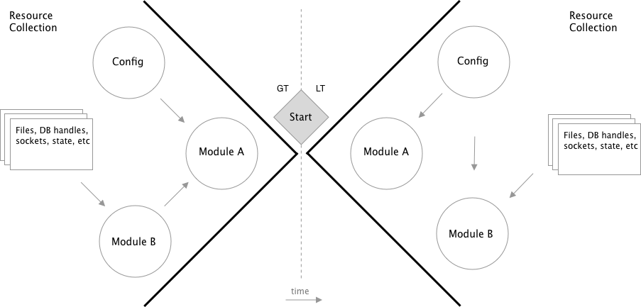

## Abstract

Programming languages rarely provide high-level patterns for the curation of
in-memory resources. Low-level provisions always exist and have strong
conventions ready for programmer consumption such as module systems,
configuration utilities, or asset packaging [1, 2]. However, even though these
resource primitives may exist at the root level of a language's programming
environment, they are often _unique_ to that programming context, and not
abstract enough to provide guidance for programming-at-large. The provisioning
and access to in-program resources appears to be studied, but with a narrow
focus on specific resources, such as configuration model approaches or
dependency injection [3,4].

I postulate that a new heuristic, hereby `GTLT` or `><`, can be applied during
application development such that programs shall tend to yield _more_ desirable
programming characteristics in contrast to applications that apply no correlated
heuristic. These desirable characteristics should be lauded as near-universally
desirable, across various programming communities (e.g. web, gaming, systems,
data-science, etc). Examples of such desirable traits may be increased tendency
of pure functions or reduced coupling between sub-systems.

`GTLT` is not intrinsically new, nor revolutionary. GTLT is a refined mechanism
to discuss and quantify a concatenation of various existing design patterns,
allowing for easier conversation and application of higher-level design between
engineers & developers.

The following article is often abstract, verbose, and redundant as the same
topics are discussed from different viewpoints. The impatient reader is invited
to skip directly to "Understanding GTLT", then processed to the Case Study.



<Caption>GT vs LT: resource preparation during application startup</Caption>

## Scope

GTLT principles don't apply everywhere.

Out-of-scope

- One-off applications/scripts
- Domains where general purpose programming patterns do not generally apply,
  such as
  - GPU programs/shaders
  - Assembly programs
  - Globals-centric programs, like R apps or Jupyter notebooks

In-scope

- Applications supporting tunable runtime configuration
- Applications producing or consuming external datas, or more plainly, doing I/O
- Applications concerned with the abstraction of resources, internal or external
- Applications expected to be tested via code

## Definitions

GTLT concepts are centered around the definition of a `Resource`.

What is a resource in the context of GTLT?

_GTLT resources are values and procedures consumed in-memory by the
application._

What about:

- CPU? Memory? L1/L2 caches? Disk?
  - No. These machine resources definitely play a role, but not in this
    discussion. Certain communities, like GPU programmers, have to orient their
    entire applications around these constraints. GTLT is not for them.
- The .NET definition of resources, "any non-executable data that is logically
  deployed with an app."
  - Yes, these resources _do count_, but GTLT considers a resource to be a
    _superset_ of this definition
- A RPC call?
  - The local binding code to execute the call counts as a resource here, but
    not _literally_ the remote procedure.
- Functions, modules, packages, primitives, constants, env, datas.
  - Yes.

## Understanding GTLT

All programs are GT, LT, or GTLT programs. _Every program_, ever. Punchcard
programs, even.

`><` can be broken down into parts. Programs can be either:

- LT, `<`
- GTLT, `><`
- GT, `>`

GTLT implies that a program may be a blend of GT & LT. Like the classic OOP
versus FP, there are not a rigid set of absolutist traits that make something
one or the other. However, when studying application code, versed programmers
should have little difficulty classifying the style of the program under
question.

GTLT programs are defined by where runtime resources are _bound_. When
classifying something in the GTLT range, you inspect whether resources wired
together early in execution then accepted by functions later, or if the are
resources bound later by modules or standalone statements themselves.

In GTLT,

- `GT` programs express intent at leaf nodes of the execution graph, with no
  direct preparation of resources. Resources (instances, factories, handles,
  config, etc) are hoisted towards the root of the program, such that by the
  time leafy nodes execute, the required resource (eager or lazy) is ready for
  direct consumption by the callee.
- `LT` programs tend to express implementation details at all levels of the
  program, often by means of self supplying (importing) resources to fulfill
  their execution.
- `GTLT` programs attempt to practice `GT` as much as feasible. GT programs
  allow for LT, ideally only for global or runtime primitive access.
  - Purists could take this further, which is discussed below.
  - When classifying a program as GTLT, it implies that GT principles are
    attempted with intention, with affordances for some LT occurrences. A
    program that by happenstance has some GT principles at work should almost
    always still be classified as LT. Classification is art here, not science,
    like much of software development.

### LT `<` programs

The defining characteristic of a LT program is that it _tends_ to obtain
resources physically adjacent to where they are needed using language specific
programming constructs, versus obtaining them via functional constructs. I
assert that functions are unique from general programming constructs in that
they are _predominantly_ a mathematical construct, but conveniently materialized
via programming constructs.

Here are examples of very basic `LT` modules:

```ts
// my-worker.ts
import Resource from "./resource";
// ^ my-worker's resource is obtained from a programming
// construct--a direct consumption of the module system
const doWork = (a: number) => Resource.work(a);
// ^ Resource is freely consumed within functions & statements in the module
```

Another basic example:

```ts
// my-worker.ts
const doWork = (a: number) => process.env.RESOURCE.match(a);
//  ^ Direct consumption of global runtime modules. This example also \
// demonstrates impurity by means of an I/O read. (Don't heckle me
//  on this, the claim isn't perfectly crisp :))
```

### GT `>`

GT programs have a single runtime entry point from which all downstream effects
originate on behalf of the programmer, as opposed to on behalf of the language
or runtime. No library or module inclusion implicitly induces effects. All
procedures accept resources as input, with the exception of module local
resources, and possibly, global primitive resources from the programming
environment tooling.

```ts
// my-module.ts
// a GT compliant module
export const doX (coll: Collection<A>) => [...coll.map(it => it.total / Math.PI)]
export const doY (resource: A, payload: B) => resource(payload, doX)
```

- Resources imported? None.
- Resources provided via functions, or within the local module scope? Check.

Global primitives, such as primitive literals (eg `[]`, array literal), were
_not_ passed in in the above example. However, they are welcome to be. Some
foundational permissions with respect to accessing to global primitives ought be
made to make programming a GT module tenable. Here's what a stricter GT
implementation of the same module may look like:

```ts
// my-module.ts
// a GT strictly compliant module
export const createModule ({ map }) => {
  const doX (coll: Collection<A>) => map(coll, it => it.total / Math.PI)
  const doY (resource: A, payload: B) => resource(payload, doX)
  return { doX, doY }
}
```

The above implementation removes the implicit global resource, array literals,
and instead passes in a `map` resource, which is compatible with the passed
`coll`ection. In our earlier example, the `Collection` type was concretely
mapped to an `Array`, but the new interface in GT strict mode allows for a
different implementation, such as hypothetically taking a `Collection` and
mapping to `Record<string, T>` type. The reduced coupling often allows for such
increased flexibility.

`Math.PI` is also an implicit global resource, and a great example of a
permitted GT violation, given that there is no tangible benefit to applying
abstraction to such a well known, universal constant.

> Is this just Dependency Injection?

Yes and no. Culturally, DI systems do not universally consider any and all
programming references or values as injectable resources. GTLT is **explicitly
widened** in this regard. Further, GTLT is tooling agnostic, and suggests that a
FP-aligned pattern can fully shift all of the "injection" responsibility to the
developer, versus 3rd party tooling. GT accelerates DI objectives far enough
such that DI programs, which otherwise are still often quite LT, should look
drastically different after a GT refactor. DI is a fantastic idea applied with
too narrow of scope. DI is also talked about with such ambiguity that its
significance and impact may be reduced to only a reflection of the tools
implementing its ideas. I am not ready to make the prior claim with certainty
because I do not have sufficient experience with enough DI tools in enough
languages. My experience using GUICE, Angular 1.x, and others certainly mold my
opinion on the topic.

> Is this just the Dependency Inversion Principle?

No. It's wider scoped, but they undoubtedly share the similar ideas. See more on
[DIP](https://en.wikipedia.org/wiki/Dependency_inversion_principle), the **D**
in SOLID.

### GTLT `><`

GTLT is the union of GT & LT. A program can exhibit both GT & LT traits.

## Why is it called GTLT

Because of the geometric visualization of the preparation of resources.

After the entrypoint to a `LT` program, resources are bound on _downstream_,
logically, on evaluation of the resource tree.

```ts
// LT, psuedo-code program graph
entry
  module::config
  module::b
    export fn_b
  module::a
    import module::b
    import module::config
    fn_a -> f(fn_b,config)
```

In a `GT` program, resources are prepped and bound up-front, then passed into
the entrypoint, who will certainly execute routines embedded within those bound
resources:

```ts
// GT, psuedo-code program graph
import module::a
import module::b
import config

module::a::fn_a(fn_b,config)
|> entry
```

## Case Study

The [citrus](https://github.com/cdaringe/citrus) app will be put under scrutiny.
Citrus is a fake app all about fruits. Delicious sweet citrusy fruits 🍊. Citrus
is a dummy server that hosts a tiny GQL & REST(-like) API to do I/O with a SQL
fruit database. Fruit records are quite basic:

```graphql
# fruit.graphql
{ id: ID!, name: String!, tastes: String }
```

### Application overview

The [citrus#lt branch](https://github.com/cdaringe/citrus/tree/lt) looks and
feels like a common typescript or node.js application. The LT patterns
demonstrated are present in nearly all programming languages, not just the node
community. The source code hosted in the citrus repository is intentionally
minimal--just four files--such that readers can follow a full transformation
from LT to GT. A downside of transforming such a small app is that the impacts
of GT may not be as readily apparent. To mitigate such risk, commentary shall
accompany and reinforce the principles behind the actions.

Let's look at an abbreviated snapshot of the LT source. Much of the files will
be truncated, with only a few interesting tid-bits left intact to demonstrate
how the application works.

```ts
// config.ts
// read config from env, assert schema

dotenv.config();
const { PORT, POSTGRES_PASSWORD } = process.env;
export const serverPort = Num.withConstraint(
  (i) => Number.isInteger(i) && i > 1000,
).check(PORT ? parseInt(PORT) : 7777);
/* ... snip snip */
export const dbPassword = Str.withConstraint((x) => !!x.length).check(
  POSTGRES_PASSWORD,
);
```

```ts
// db.ts
// prepare a database client pool

import pg from "pg";
import { dbConfig } from "./config";
export const pool = new pg.Pool(dbConfig);
```

```ts
// server.ts

import Koa from "koa";
import { createServer } from "http";
import { serverPort, serverHostname } from "./config";
import { postgraphile } from "postgraphile";
import { pool } from "./db";
import { promisify } from "util";

// create an empty server
const app = new Koa();
export const server = createServer(app.callback());

// setup a GET /fruits/:id route
app.use((async (ctx, next) => {
  const [_, id] = ctx.path.match(/fruits\/(\d+)/i) || [];
  if (id)
    ctx.body = await pool
      .query({
        text: `select name from fruits where id = $1 limit 1`,
        values: [id],
      })
      .then((r) => r.rows[0].name);
  return next();
}) as Koa.Middleware);
// setup a graphql handler, with graphiql instance,
// reflecting the database schema
app.use(postgraphile(pool, ["public"], { graphiql: true }));

export const listen = () =>
  promisify((port: number, hostname: string, cb: () => void) =>
    server.listen(port, hostname, cb),
  )(serverPort, serverHostname);

// start & announce the server
if (!module.parent)
  listen().then(() =>
    console.log(`started on ${serverHostname}:${serverPort}`),
  );

// client.ts - omitted
```

In less than 50 lines, a very basic application has been expressed.

If the database and server were both started, one could open
`http://localhost:7777/graphiql`, execute a basic query:

```graphql
{
  allFruits {
    edges {
      node {
        id
        name
      }
    }
  }
}
```

and get a rather unamusing result:

```javascript
{
  "data": {
    "allFruits": {
      "edges": [
        {
          "node": {
            "id": 1,
            "name": "strawberry"
          }
        },
        {
          "node": {
            "id": 2,
            "name": "apple"
          }
        },
        {
          "node": {
            "id": 3,
            "name": "orange"
          }
        }
      ]
    }
  }
}
```

### Migrating the config module

GT does not allow for effects as part of module load. Remember, GT states that
execution begins explicitly after the programmer commisions the app to start,
after resource preparation. Reading runtime resources and actively operating
with them during module evaluation _both_ constitute violations. Consumption of
such resources should only occur after the program has been explicitly started
in earnest by programmer intent.

```diff
- dotenv.config()
+ export const loadEnvConfig = () => dotenv.config()

- export const serverPort = process.env.PORT ? /* ... */
+ export const getConfig = (env: Record<string, string>) => {
+   return {
+     serverPort: env.PORT ? /* ... */
+   }
+ }
```

`dotenv.config()` is a popular API that mutates the node.js VM's `process.env`
memory with key-value pairs from a text file. Eager effects like this mutation
make software modules extremely rigid. Such an effect limits code reuse
opportunity. More importantly, the effect was not expressed directly by the
programmer to execute. Like most patterns found in GT, _things happen_ as a
result of function invocations, and thus should be associated with verbs. GT
naturally promotes explicit expression of intent, and demotes implicit behaviors
like these. Thus, eager invocations during module sourcing is considered a GT
violation.

One may have observed that onload we were previously reading directly from the
`process.env` references. This is a paramount GT violation. Resources should be
passed, or minimally support being passed. One can see that after the diff is
applied, the application's configuration is no longer implicitly generated by
the effect of module load. Instead, the configuration provided by the module
must be explicitly requested via function. By acknowledging that the application
configuration value is truly a _function_ of the environment (in the
mathematical sense), code comprehension should increase after the refactor by
means of reducing implicitness. Why is this simple refactor powerful? Other
modules in the system are now much less likely to couple themselves to the
config module. Even if some coupling remains, the coupling will be reduced to a
single edge (calls to `getConfig`), vs. N edges, where N = count of
configuration values. Applications with fewer runtime edges between module nodes
are intrinsically simpler. Additionally, authoring tests becomes more tenable,
as explored next.

### Migrating the config module tests

What are some challenges we may encounter testing the `LT` version of the
configuration module?

- If env var inputs are evaluated on module load, how do we test different
  inputs?
- If we do test different env inputs, how do we do so without meddling with our
  actual testing process?

Unfortunately (that's right--unfortunately), languages support mechanisms for
addressing the above. Let's break down the full LT test module for our config.ts
file.

```ts
// config.test.ts - (jest testing framework)
const KNOWN_GOOD_ENV = { PORT: "7890" /* snip */ };

describe("config", () => {
  const OLD_ENV = process.env;
  beforeEach(() => {
    // :|
    jest.resetModules();
    // :|
    process.env = { ...OLD_ENV, ...KNOWN_GOOD_ENV };
  });

  afterAll(() => {
    // :|
    process.env = OLD_ENV;
  });

  it("should not error on import", () => {
    expect(() => require("../config")).not.toThrow();
  });
  [
    {
      case: "bad db pw",
      envPatch: {
        POSTGRES_PASSWORD: "",
        DB_PASSWORD: "",
      },
      errorMatch: /env.example/,
    },
    {
      case: "bad port",
      envPatch: {
        PORT: "100",
      },
      errorMatch: /constraint check/,
    },
  ].map((opts) =>
    it(`should error on ${opts.case}`, () => {
      // :|
      process.env = { ...process.env, ...opts.envPatch };
      expect(() => require("../config")).toThrowError(opts.errorMatch);
    }),
  );
});
```

We overcame all of our aforementioned challenges! But we sacrificed many values
in order to do so. What is undesirable about this code?

1. Mutations of the running process. Almost _never_ is it ok to meddle with your
   running process in order to test a module. Absolutism is generally unwelcome
   in programming, however, there are severe drawbacks to this. First, how can
   you safely run tests in parallel, which such mutations? Plainly, you cannot!
   Reads to your dynamically mutated world will yield non-deterministic values
   as inputs for scenarios under test, causing unpredictable failures.
   Synchronization problems are common in code like this. Secondarily, when you
   mutate a process that is not ultimately owned by you, what guarantees do you
   have that such mutations are safe? From a user's perspective, `jest` owns
   this process--it is the entrypoint and control flow executor. It is intrusive
   for the tester to mutate the owner's process without permission.
2. Dropped static analysis & typing on the module under test. In our case, we
   have to use `require` over import, such that we could do a _dynamic_ require
   versus a static import. We have to do this, again, because the module
   evaluation is effectful, so we need to call `require` to get a readable
   output. This indirect use of require to execute configuration evaluation is a
   naive and indirect design. Correctness is incredibly valuable. Static
   analysis is often a major component on the road to correctness. Sacrificing
   it must be justified. The sacrifice is not justified here, especially because
   it is so easy to avoid, as we will see shortly.
3. Overhead of managing the module system. See usage of `jest.resetModules()`.
   Much of the code in this test suite is oriented around managing _test_ state,
   specifically around the VM's module system cache. This effort onboards cost
   and detracts from focus on the module under test.
4. State resets. A consequence of the undesirable mutation discussed above is
   that we now must clean the ephemeral, dirtied state. What happens when
   fallible programmers forget to reset their state? What happens when there is
   an error, and state reset logic is not triggered? If these sound like
   _unlikely_ errors to the reader, rest assured that optimistically managed
   mutable state is a still a common programming behavior in 2020. Managed
   mutable state is undeniably the modus operandi for many professional
   programmers. The most popular languages in the world right now are dynamic,
   and allow for this behavior by default. Even those languages that do have
   state of the art typesytems allow for such behavior. I do particularly like
   how `rust`-lang forces users to opt-in to mutability via a `mut` keyword.
   This makes mutable memory exceptional, markes it almost as a wart, and
   hopefully prompts the user to reduce usages as much as feasible.
5. Evaluation order negatively impacts test case specificity. In one test case,
   when `dotenv.config()` reads the filesystem, it throws because
   `POSTGRES_PASSWORD` is non-truthy. However, I did not want to test
   `dotenv.config()` logic at all. Instead, I wanted to test the password schema
   validator beneath it. To work around this, the test now needs to _know_ about
   the internal module structure and mock out the dotenv module. How cumbersome.

Module systems in many languages allow for eager binding and execution of
resources. Even `OCaml`, my new crush. The consequences of this capability
cannot be understated. There is not much code in this test file, yet even so,
we've enumerated quite a few macro consequences induced by simply programming in
common LT style.

To be fair, it is worth confessing that the _creation of functions_ on module
evaluation is certainly eager evaluation, effectually creating resources.
However, we make exceptions for functions as they are mathematical in nature and
naively assumed _uninvoked_ on module evaluation by GT. The effect of creating a
function resource serves the purpose of creating a resource flow graph, defining
all possible future flows of resources, including functions themselves, after
the entrypoint function is formally invoked.

Back to tests. When we GT-ified our config module, how did those tests look
afterwards?

```ts
// config.test.ts - (jest testing framework)
import { getConfig } from "../config";
const KNOWN_GOOD_ENV = { PORT: "7890" /* snip */ };

describe("config", () => {
  it(`should accept valid env`, () => {
    expect(() => getConfig(KNOWN_GOOD_ENV)).not.toThrowError();
  });
  const failureCases = [
    /* snip */
  ];
  failureCases.forEach((opts) =>
    it(`should error on ${opts.case}`, () => {
      const env = { ...KNOWN_GOOD_ENV, ...opts.envPatch };
      expect(() => getConfig(env)).toThrowError(/constraint check/);
    }),
  );
});
```

What has changed? We'll, all of our configuration is now the result of a
function call. We removed _all_ of our hacks, and all of the raised concerns
immediately vanish.

_Pure functions_.

Thanks, pure functions. I skipped out on testing logic that exercised
`dotenv.config()` for brevity, which is also a key difference. However, we
didn't explicitly test it previously. It could be further be argued that such a
test would be frivolous. But let's pause that discussion and keep focused on
GTLT!

### Migrating the db module

```ts
// db.ts - lt
import pg from "pg";
import { dbHost, dbPassword, dbPort, dbUser } from "./config";

export const pool = new pg.Pool({
  host: dbHost,
  port: dbPort,
  user: dbUser,
  password: dbPassword,
});
```

```ts
// db.ts - gt
import pg, { PoolConfig } from "pg";
export const createPool = (opts: PoolConfig, db = pg) => new db.Pool(opts);
```

Config resources are now passed, not self-sourced via direct import. The
database module resource is now passed, not self-sourced via direct import.

However, was it worth keeping this module at all?

```ts
// flip the createPool args
export const createPool = (db, opts) => new db.Pool(opts);
// remove the extra call
export const createPool = (db) => db.Pool;
```

Omitting the fact that we dropped the `new` keyword, `createPool` has been
reduced to function that just does an object field lookup. That does not warrant
a software module! For this reason, our GT transition _removes_ this full
module, outright.

At this point, we need to move our db pool creation inline to wherever it is
needed and adjust tests to accommodate. One place that uses the db pool is
`server.ts`. However, because server.ts is effectful on eval, just like
config.ts above, we need to update our test mocks during this incremental
transition.

```diff
-jest.mock("../db", () => {
+jest.mock("pg", () => {
-  return {
-    pool: {
-      query: async () => {
-        return queryResult;
-      },
-    },
-  };
+  function Pool() {}
+  Pool.prototype.query = async () => {
+    return queryResult;
+  };
+  return { Pool };
});
```

### Migrating the server module

In a nod to
[functional core, imperative shell](https://www.destroyallsoftware.com/screencasts/catalog/functional-core-imperative-shell),
let us move the effectful entities of server.ts to bin.ts, and study the new
file's roles and responsibilities.

```ts
// bin.ts
/* import module resources */
/* prepare resources */
/* execute GT entry point */
```

This psuedo-code concisely represents the heart of GT. General resources are
curated then passed into a logical beginning of general execution. After we have
globbed up resources, we thread them through a needle, a single entrypoint
representing the vertex of the greater-than symbol `>` in GT. When execution
reaches that sharp point, it is reasoned that the program now begins executing
_raw intent_, verses the LT execution of intent+resource orchestration.

We can conceptualize the execution of a LT program by imagining that the
entrypoint opens module X, X opens Y, and Y executes to produce value Z". GT
pulls all of that imperative behavior inside out. It's analogous to reaching
into a sock, pinching the toe area, and pulling it inside out. When you
conceptualize execution in GT, you think of the LT flow, but with an inverted
perspective. "To get the final produced value Z, we previously bound Y as the
producer of Z, and we bound system X to implement Y". `>` vs `<`.

🏏☠️🐴

Here's our actual bin "shell":

```ts
// bin.ts
import { getConfig, loadDotEnv } from "./config";
import { Pool } from "pg";
import { bindMiddlewares, createServer, listen } from "./server";
import Koa from "koa";
import http from "http";

async function start() {
  /* prepare resources */
  loadDotEnv();
  const config = getConfig(process.env);
  const { serverHostname, serverPort, dbHost, dbPassword, dbPort, dbUser } =
    config;
  const pool = new Pool({
    host: dbHost,
    password: dbPassword,
    port: dbPort,
    user: dbUser,
  });
  const [app, server] = createServer(Koa, http);
  bindMiddlewares(app, pool);

  /* execute GT entry point */
  await listen(server, config);
  console.log(`started on ${serverHostname}:${serverPort}`);
}

start();
```

Let's take a peek at the _full_ server.ts file. Unsurprisingly, server.ts is now
a small set of functions.

```ts
// server.ts
type GqlMiddleware = typeof postgraphile;
type Http = typeof http;
type KoaConstructor = typeof Koa;
type WithApp = { app: Koa };
type WithGql = { gqlMiddleware: GqlMiddleware };
type WithPool = { pool: Pool };

export const createServer = (App: KoaConstructor, { createServer }: Http) => {
  const app = new App();
  const server = createServer(app.callback());
  return [app, server] as const;
};

export const createFruitMiddleware: (pool: Pool) => Koa.Middleware =
  (pool) => async (ctx, next) => {
    const [_, id] = ctx.path.match(/fruits\/(\d+)/i) || [];
    if (id)
      ctx.body = await pool
        .query({
          text: `select name from fruits where id = $1 limit 1`,
          values: [id],
        })
        .then((r) => r.rows[0].name);
    return next();
  };

export const createMiddlewares = ({
  pool,
  gqlMiddleware,
}: WithPool & WithGql) => [
  createFruitMiddleware(pool),
  gqlMiddleware(pool, ["public"], { graphiql: true }),
];

export const bindMiddlewares = ({
  app,
  ...rest
}: WithApp & WithPool & WithGql) => createMiddlewares(rest).forEach(app.use);

export const listen = (
  server: Server,
  { serverPort, serverHostname }: Config,
) => new Promise((res) => server.listen(serverPort, serverHostname, res));
```

Something readers may notice is that, plainly, the GT version is more code.
That's a proper downside to GT.

- To accept resources, logic must all be nested in functions. More functions =>
  more LOC.
- To author functions, additional structs and type definintions may need to be
  authored. More defintions => more LOC.
- To use resources, some LOCs may be added to support unpacking values or
  renaming symbols. More statements => more LOC.

Extra content _absolutely_ hinders readability in comparison to LT. A flat
imperative instruction set, as seen in the LT program, reads comfortably like a
good book. This code does not exhibit that trait. However, keep in mind that
_server.ts_ is not _supposed_ to read like a book--the imperative, readable
nature of the old version was ported into to `bin.ts`. The readability trait
_is_ still present and active in that file. There's a readability upside here
now too. Individual `server.ts` functions tend to do _very little_. Even more
so, these functions tend to all be verb oriented. How did this come to be? By
happenstance? By hoisting resource preparation upstream, keeping resource
coupling _out_ of server.ts, the actual steps within functions are quite terse,
and often realizable in simple expressions. The unwelcome union of resource
manipulation and expression-of-intent within function bodies yields complexity,
common to LT applications. Remove the former, and functions take a clear &
expressive form.

<small>
  Aside: If you are thinking that algebraic effects are the next logical
  evolution in this process, such that we can just _express intent_ without
  passing resources--me too. In 2020, we're not yet in an effects enabled world.
  I intend future writings to drill down on this.
</small>

`bindMiddlewares` is a great example of the advantages we just discussed. It
vaguely has the form of:

`resources => iterator(f, collection)`

Simple, as promised! Let's study the real version:

```ts
export const bindMiddlewares = ({
  app,
  ...rest
}: WithApp & WithPool & WithGql) => createMiddlewares(rest).forEach(app.use);
```

This function is small and easily grokable. Ironically, applying GT rapidly
assists in revealing outstanding GT violations quite well. Was
`createMiddlewares` passed in as an argument? Was the logic that wired
`createMiddlewares(...)` to `app.use` passed in? They are not! Due to these
violations, can we even claim this to be a GT function? _Yes,_ but justification
is warranted.

A function must offer _intrinsic value_. If logic for doing _work™_ is
considered a resource, and we continuously declare that something _above the
function_ under study is responsible for providing the resource, we have a
non-halting condition where nothing is ever permitted to _own_ necessary work.
Thus,

- GTLT permits local function resources that are supportive of the intrinsic
  nature of the function
- GTLT is permissive of local module function references

With these permissions, `createMiddlewares` doesn't need to be passed in.
Further, `bindMiddlewares` can itself create ephemeral resources to execute
_whatever is needed for binding_ middlewares. An interesting exercise is to ask
"What if we tried hoisting these entities from bindMiddlewares" upwards? See the
`#gt/3-fn-instrinsics` branch. Here's what I suggest it could look like:

```ts
// server.ts
type WithCreateMiddlewares = { createMiddlewares: typeof createMiddlewares };
export const bindMiddlewares = ({
  createMiddlewares,
  bind,
  ...rest
}: /* snip */
WithCreateMiddlewares & {
  bind: (mws: Koa.Middleware[]) => void;
}) => bind(createMiddlewares(rest));
```

```ts
// bin.ts
bindMiddlewares({
  app,
  createMiddlewares,
  pool,
  gqlMiddleware: postgraphile,
  bind: (mw) => app.use(mw),
});
```

Pause for a moment to study what's really going on here. `bin.ts` now knows of
createMiddlewares, and specifies the binding implementation. For what? To call a
function _named_ `bindMiddlewares`? If `bin.ts` knows how to create and bind
middlewares, what's the point of `bindMiddlewares` at all? Candidly, not a lot!
`bindMiddlewares` has been stripped of its intrinsic value. It does read nicely,
but `bindMiddlewares` intrinsically should own `bind`ing middlewares! Instead,
in pursuit of extreme GT principles, idealism has defeated common sense. For
this reason, the prior discussed affordances are made. We allow local module
references, and we allow functions to define inline resources to carry out their
purpose. Without these affordances, programs would have to represent intent &
implementation details entirely during the resource preparation phase,
undermining the value of functions and module systems outright.

### Migrating server test code

The interesting elements of study for the server test code are not _what_ is
included, as much as what is not included. No module patching required. No hard
coupling of the server config module to the the server module. No state resets.
No constrained parallelism, beyond those constraints from the test framework.
Our fixture creates a configuration, passes it to the server module functions,
enabling clean preparation and removal of resources, pre and post test. Without
a doubt, GT code produces better testing code than LT, even if it comes with
tradeoffs discussed previously.

```ts
let fixture: ServerFixture | null = null;

beforeEach(async () => {
  fixture = await createFixture();
});
afterEach(() => fixture?.server?.close());

describe("server", () => {
  it("should return a fruit on GET /fruit/:id ", async () => {
    fixture?.queryMock?.mockResolvedValue({
      rows: [{ name: "teststrawberry" }],
    });
    const fruit = await fixture?.client?.getFruitById(1).then((r) => r.text());
    expect(fruit).toMatch(/teststrawberry/);
  });
});
```

## Case Study Conclusion

The case study showed a brief translation between LT & GT code. The primary
takeaways were that:

- GT code produced cleaner tests
- GT yielded terse, expressive functions
- GT code moved imperative code towards the program root, and left function
  oriented (not strictly FP) code to modules
- GT promoted a breakup between logical intent expression, embodied by the
  function verb, and resource curation to satisfy that intent
- LT code was more compact
- LT code was less portable
- LT code demonstrated more per-module coupling, observed by the count of symbol
  import edges between local modules

Feel free to head to the [citrus source](https://github.com/cdaringe/citrus) to
study further.

## FAQ

### Isn't this just `...`

DI? DIP? FunciontonalCoreImperativeShell? As discussed above, yes and no. GTLT
is a sum of various of these ideas, wrapped in new language. Again, GTLT as a
geometric concept should enable design discussions, using prior art as embedded
talking points.

> This (program|module) could be more GT _if_ you apply DI in function X.

<br />

> This file exhibits some GT violations. 3rd party modules are being imported
> and used directly by functions Y & Z.

<br />

> This module is not side-effect free on load. If you apply some GT refactors
> here, it would be easier to test. What do you think?

### If GTLT had a function signature, what would it be

Maybe something like `resources => resources => work => ()`? It's not really a
valid question anyway :).

## References

1. https://docs.oracle.com/javase/8/docs/technotes/guides/lang/resources.html
2. https://docs.microsoft.com/en-us/dotnet/framework/resources/
3. https://patents.google.com/patent/US7263699B2/en
4. https://sisis.rz.htw-berlin.de/inh2012/12402528.pdf
