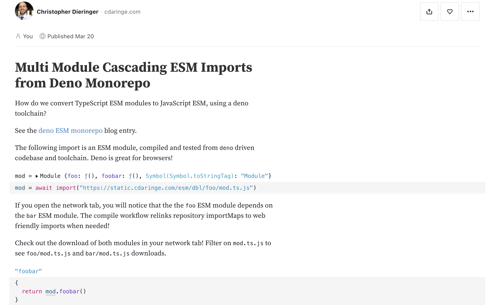

## Context

Suppose you are building applications for **browsers**. Suppose that you have a
design in mind for your project, warranting many modules. You want to:

- author & test these modules with some amount of independence from one another
- develop each of these modules concurrently

A monorepo is often the solution for these needs.

With the advent of `deno` and `esm`, this is an increasingly common pattern.
Defining "monorepo" is out of scope, but for simplicity sake I will make an
assertion that a monorepo hosts independent projects that may or may not
reference one another. Consider
[deno_std](https://github.com/denoland/deno_std). `deno_std` has `http` and `fs`
concerns baked into the same repository, and is thus considered a monorepo from
this point forward.

## Problem Statement

- There is no well established workflow to compile individual browsers libraries
  in a monorepo from TypeScript to ESM with `deno`<sup>1</sup>

Alternatively,

- TypeScript libraries are not consumable by browsers using ESM without
  pre-processing, but a pre-processing workflow is not well known for `deno`
  oriented monorepos

<small><sup>1</sup> Assuming no bundlers are applied</small>

## Requirements

- `import`s work in development using `deno`
- `import`s work in production using browsers
- `sourceMaps` work in production using browsers
- TypeScript compiles to ESM, on a per file file basis
- ESM artifacts can be uploaded directly to HTTP static serving hosts, with no
  further processing required

## Research

What options do we have to to publish TypeScript ESM libraries using `deno`? So
much of the conversation in Deno is around getting pre-existing JS resources
_into_ `deno`. What we want is the inverse--to get great work from a `deno`
starting project into browsers!

1. **Bundle libaries with `deno bundle`**

- ❌ This strategy is undesirable, as
  - Libraries are meant to offer incremental bits of functionality. Bundling
    implicitly turns libraries into fully baked, statically linked SDKs, which
    do not compose or dedupe well.
  - Bundling is more fit for applications, versus libraries
    - In some cases, bundling may be acceptable. We will operate under the
      assumption that bundling is not appropriate for library distribution.

1. **Publish .ts source code**, just as https://github.com/denoland/deno_std
   does
   - ❌ This strategy is undesirable, as
     - Browsers cannot `import()` TypeScript natively
     - CDNs cannot read TypeScript modules as ESM, compiled on the fly
       - `esm.sh` does offer partial support for this, but has macro inhibitors:
         - uses a bundler under the hood, which is intrinsically wasteful. we
           seek to _not_ bundle source code for this use case.
         - uses `npm` as it's module entrypoint, versus github or an arbitrary
           static file server
1. **Run `tsc` and upload the artifacts**
   - ❌ This strategy is undesirable, as
     - We want to use `deno`, not `tsc`
     - `importMap`s do not work
1. **Use `Deno.emit(...)`, and rewire imports**
   - ✅ Let's explore this below

## Solution - `deno esm browser (deb)` & `Deno.emit(...)`

**To jump directly to the code solution**, you can see the
[`build` function in the `deb` module, checked into the rad repository](https://github.com/cdaringe/rad/tree/next/src/build-buds/deb).

Consider that using `deno` often implies use of the following features:

- `importMap`s
- `TypeScript`

These are powerful tools, and are both commonly used in the `deno` space. They
are **not required** for use in `deno`, they are simply common, and thus should
be supported. If we are building browser-ready modules, we want to support these
features.

How could it work? If you'd like to follow along interactively, you can see a
[fully featured demo here](https://github.com/cdaringe/deno-browser-libs), for
those who want to try it out.

Let's consider some input source:

```ts
// foo/mod.ts
import { bar } from "bar/mod.ts";
export const foobar = () => `foo${bar()}`;
```

Assume that `bar/*` is resolved via an import map, e.g.
`importMap.development.json` during dev. I may run
`deno --import-map importMap.development.json test foo/mod.test.ts` to test
`foo/mod.ts`. Deno reads and tests this browser module just fine!

Getting this TypeScript ESM to JavaScript ESM is easy. Call `Deno.emit(...)` on
this module, and you will get:

```ts
// foo/mod.ts.js
import { bar } from "bar/mod.ts";
export const foobar = () => `foo${bar()}`;
# sourceMap=...
```

Not bad. What problems exist?

- **bad resolution**: `bar/mod.ts` will not be resolved by a browser.
  `bar/mod.ts` is not a relative sibling to `foo/mod.ts`
- **wrong asset type**: `bar/mod.ts` is still a TS file :/
  - Interestingly, `bar/mod.ts.js` _was generated_, as it is part of
    `foo/mod.ts`'s import graph!

How can we solve these problems? Let's focus on module resolution first. Suppose
we know what our HTTP server or CDN base URL is going to be upfront. For
instance, I host static assets on `static.cdaringe.com`. If I want to publish to
my own static file server, I know my hostname and pathname for where I want to
upload these assets!

Just like I am using `importMap.development.json` to resolve `bar/*` in
development, I can author a `importMap.production.json`, and simply re-write
imports post-compile. Let me update `importMap.production.json` to map
`{ "bar/": "https://static.cdaringe.com/esm/dbl/bar/" }`

In other words `Demo.emit(...) |> rewriteImports("importMap.production.json")`
yields something like:

```ts
// foo/mod.ts.js
import { bar } from "https://static.cdaringe.com/esm/dbl/bar/mod.ts";
export const foobar = () => `foo${bar()}`;
# sourceMap=...
```

Excellent! Pop on a `.js` extension during import re-writes, and we will have
solved all outstanding problems:

```ts
// foo/mod.ts.js
import { bar } from "https://static.cdaringe.com/esm/dbl/bar/mod.ts.js";
export const foobar = () => `foo${bar()}`;
# sourceMap=...
```

After pushing the build artifacts up, we can now try importing the ESM JS
assets.

[Demo on ObservableHQ](https://observablehq.com/d/206dd5d6408f32ce)



So how did we actually compile it? Rather than repeat documentation in other
places, instead allow me to guide you via links, end to end:

- I've
  [published a `build` function](https://github.com/cdaringe/rad/blob/40355c73b7d3b39d7a6464297bf4c5bf609d58bb/src/build-buds/deb/mod.ts#L5),
  that accepts ESM module filenames to compile
  - `Deno.emit` finds each file in the import graph, and emits an ESM module &
    .map file next to the associated `.ts` file
    - You can use the `outDir` option, to move all of these ESM assets to a
      directory of your choice, versus polluting your source code directories
  - Post compilation, we visit every emitted ESM source file and ask
    - What imports are used here?
    - For every import,
      - is there a mapping for this import in the provided production importMap?
        - if so, re-write the import, and flush it to disk
- I've
  [plugged the build function into a project where I want to publish foo & bar libraries](https://github.com/cdaringe/deno-browser-libs/blob/a42285d55d5b55a3d22b330552dd6e207d67c796/rad.ts#L9-L13),
  and it emits all the ESM to the `.build` directory.

I simply the `rsync`'d the ESM to my static file server, and the ObservableHQ
demo above works!

## FAQ

> Why use Deno at all here?

Deno is the superior toolkit & runtime for developing browser libraries.

- typescript: zero config needed for authoring browser libraries. _zero_. open a
  typescript file, starting using browser APIs with great TS types.
- performance: deno uses a highly performant compiled module caching strategy
  that covers the entire runtime, not just the project in play. this means
  normal TS performance on first run, and high performance on all incremental
  changes
- testing: No JSDom, no jest. `Deno.test(...)` is all you need. It has browser
  runtime primitives baked in, versus needing to polyfill/shim in a virtual
  browser env, a la JSDom/happy-dom.

<br/>

> What if my TypeScript imports external Deno modules

Right--this project only converts _your_ Deno source code to ESM--not the whole
world's! If there are external, browser friendly, TypeScript ESM modules you
want to tap into, you could:

**Option 1**: Add `git submodule`s for your dependencies.

- import your dependencies via local importMap references, then
- publish the compiled 3rd party modules in the same structure as referenced in
  development

This option isn't great, as `git submodule` adds moderate complexity to all
workflows. However, conceptually, it's quite simple if you're willing to add
`submodule` functionality to your project.

**Option 2**: An ESM server, such as
[emit_esm_server](https://github.com/cdaringe/deno-emit-esm-server)

In this strategy, you must deploy a server to produce ESM. However, it does have
a huge benefit--you can import TS files directly from your JavaScript, and it
_just works_. Slow, probably needs loads of optimizations contingent on use
case, but works.

```yaml
# docker-compose.yaml
deno_emit_esm_server:
  image: cdaringe/deno_emit_server
  deploy:
    resources:
      limits:
        memory: 120M
```
