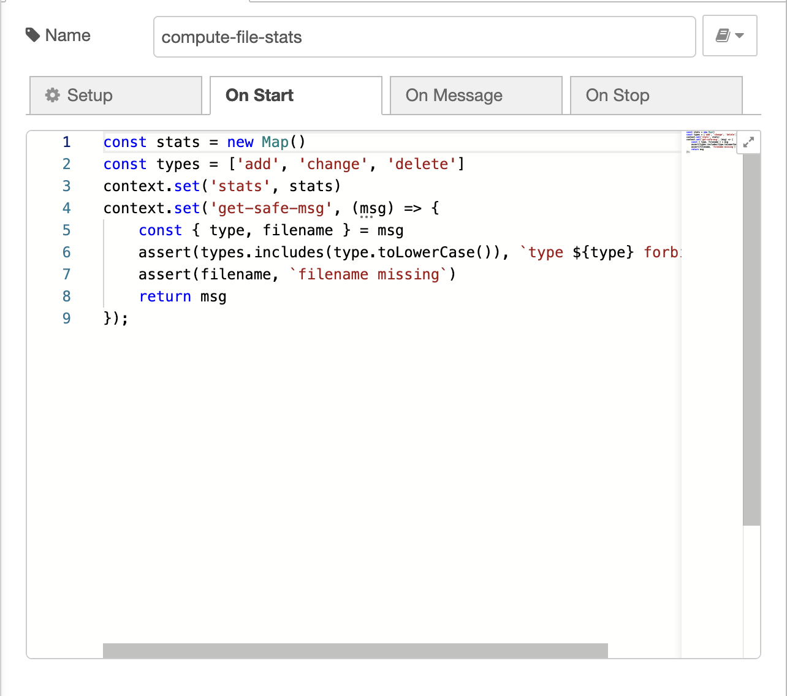

## Context

I have long been interested in the viability of
[visual programming languages (VPLs)](https://en.wikipedia.org/wiki/Visual_programming_language)
for general purpose programming. VPLs tend to be domain specific, most often in
hardware space. There has been a recent
[flurry of fresh activity](https://news.ycombinator.com/item?id=27705631) in
this old topic, so I want to make a fresh re-assessment.

## Evaluation Criteria

Comparing my VPL of choice to well known general purpose programming languages
du jour:

- Can architecture be easier to learn or convey?
- Can contributions be made more safely to the application or library?
- Can the testing UX be improved?
- Can iteration speed or ease be improved?
- What orthogonal threats are introduced?
- What orthogonal benefits are introduced?

Some of these inquires are direct proxies to "can net quality be improved" which
is certainly a question I want to answer as well. However, I am interested in
the minutia, the UX, the feeling, and both the literal and perceived sense of
robustness when trading traditional programming languages for a VPL.

## Experimental Tooling

There are two VPLs that I think are currently worthy of evaluation:

1. [enso](https://enso.org/)
   1. I did not select enso due to:
      1. You must _login_ to use the editor. This removes its general viability
         somewhat extensively.
      1. It has done >6 months without a release
         1. These two signals told me this tool (perhaps amazing tool) is not
            yet ready for primetime. I value trying out bleeding edge tools, but
            I am in search of proper viability, which mandates some modicum of
            stability.
1. [node-red](https://nodered.org/)

Let us select `node-red`. node-red is a good candidate because it is under
continuous active development, has extensive documentation, and seems to exhibit
a sound balance of high capability with good UX. If you can the VPL wiki and
read the many HackerNews threads, you can observe that few tools are actually
mature enough for general purpose programming, let alone those which you would
actively deploy into production.

## Experiment

### Filesystem Watcher Stats

Objective: write a program that reads a directory recursively, watches it, and
continuously emits stats about the directory. Let's just include:

1. count of files
2. cumulative size of all files (bytes)
3. avg file size

It turns out, node-red already offers a FS watcher out of the box, albeit less
powerful. I was not aware! Nonetheless, here is the whole program:

It's a simple program, by design. Even so, wiring up a watcher and computing
derived state from a stream of file-stat messages could be argued as
non-trivial. The flow of this diagram _does_ make this application look quite
trivial, which is an interesting observation on its own.

The first node is an `Inject` node name `init`. I probably should have named
this step `emit-configuration`. This node is immediately emits on program start.
If we were writing an imperative program, this step would be implicit.
Nonetheless, the setup that I author in the `init` step would be multi-line, and
perhaps not so clearly grouped/encapsulated were it in, say, a bash program.

If I pop open the config, you'll see:

I have hard coded these values, but they certainly could have been read from
config, a message, or the environment. These `msg` values are
[chokidar.watch](https://github.com/paulmillr/chokidar) params.

The `init` node sends a config message into a `function` node named
`setup-file-watcher`. It would be interesting to write the file watcher from
scratch, but x-platform filesystem watchers are known finicky to author.

The `setup-file-watcher` is somewhat interesting, as it demonstrates:

1. tapping into the programming environment when users want to drop out of the
   VPL
2. modular design in the VPL

Let's jump into a few tabs in the `setup-file-watcher` node.

I need a few libraries. node-red makes importing and exposing them trivial.

`chokidar` is a node.js file watching utility. `assert` is the node.js builtin
assertion library.

Next up, `On Message`. In the current state, I expect only one config message,
thus setup a file watcher as a singleton for the `node`. However, this could be
minimally tweaked to permit many file watchers created from many messages. I
bind the file-watcher instance (chokidar instance) to events, mapping them back
to the VPL via `node.send(...)` calls. This is great--I love the concept of
`node.send(...)` invocations sending messages through the rest of my `node-red`
`flow`. Additionally, I set some `node` level state, which allows me to clean up
the memory and teardown the watcher when my program exits.

The final interesting part of the application is a `compute-file-stats` function
node. Again, I use the `function` type node. This node:

1. instantiates some persistent node state, mapping a `filename` string to
   `fs.Stat` instance
1. processes many messages, where
1. each message mutates the mapping and emits an updated stat aggregate

You may be thinking "that's a lot of JavaScript, not using VPL tools" to compute
the file statistic message. You're right. Put a pin in that thought, and we'll
come back.

Finally, we plumb the statistic message from the `compute-file-stats` node into
a `debug` node, just so we can pretty print our messages somewhere.

From `node-red`, I can hit the **Deploy** button. Now, I can start adding,
changing, and deleting files in my watched folder, and observe realtime outputs.

<iframe
  width="100%"
  style={{ minHeight: 400 }}
  src="https://www.youtube.com/embed/MQCJhcP75_c"
  title="YouTube video player"
  frameBorder="0"
  allow="accelerometer; autoplay; clipboard-write; encrypted-media; gyroscope; picture-in-picture"
  allowfullscreen
></iframe>

Revisiting the "not using VPL tools" discussion. We wrote our full stats
reduction in JavaScript, versus using any VPL reduction primitives. `node-red`
does not offer a great mechanism to actually do lower level data processing
outside of JavaScript. Its strength is more in passing the datas along to macro
processing units. Due to no support of multiple inputs, implementing a something
as simple as a map-reduce with their VPL constructs is quite cumbersome. I
created a
[successful proof of concept, and some of the community also pitched their ideas](https://discourse.nodered.org/t/feasibility-of-implementing-functional-operators-without-javascript/62361)
in on the `node-red` forum. So, it's achievable, but the complexity it adds may
diminish its practical value.

## Evaluation

### Q: Can architecture be easier to learn or convey?

Absolutely. The visual nature of the design, and the ability to link in subflows
are very powerful. Rather than jumping through flat files, the flow modularized
the relevant code, field, and general data in logical, named buckets that had
clear association with a step in the flow. The step in the flow was self evident
by means of association with edges between nodes, as opposed to imported modules
commonly used by popular programming languages.

### Can contributions be made more safely to the application or library?

Unlikely.

There is no visual-VCS tooling in this space at the moment. `node-red`
collaborators would be studying diffs of JSON files, which is worse than
studying code, as you are study _serialized_ code, versus code itself.
Furthermore, conflicts would be frequent in a team of multiple contributors
working on the same segments of the application.

### Can the testing UX be improved?

Maybe. The node-red forums have various users discussing this. There are no
best-known-methods or patterns in place. However, some simple patterns could be
thought up to make this a possibility. I'm quite confident that by practicing a
few conventions around the application's configuration model and the way
`Inject` nodes are used at the beginning of flows, an interesting and powerful
integration testing mechanism could be blissfully developed. I halted exploring
this deeply, due to lack of ability to execute `map-reduce` visually with
elegance.

### Can iteration speed or ease be improved?

Unknown. Without the testing story flushed out, it is too hard to tell. A
professional iteration cycle requires both a good development story and a good
testing story. The development story has strong traits, namely around
encapsulation and clean coupling, but is missing strong traits like strong
typing, inference, etc.

### What orthogonal threats/benefits are introduced?

Skipped, for the same reason iteration evaluation speed evaluation was skipped.

## What's next?

Repeat the experiment in enso!
